## 第 1 章 设计模式简介

### 1.1 设计模式简介

设计模式（Design pattern）代表了最佳的实践，通常被有经验的面向对象的软件开发人员所采用。设计模式是软件开发人员在软件开发过程中面临的一般问题的解决方案。这些解决方案是众多软件开发人员经过相当长的一段时间的试验和错误总结出来的。

设计模式是一套被反复使用的、多数人知晓的、经过分类编目的、代码设计经验的总结。使用设计模式是为了重用代码、让代码更容易被他人理解、保证代码可靠性。 

毫无疑问，设计模式于己于他人于系统都是多赢的，设计模式使代码编制真正工程化，设计模式是软件工程的基石，如同大厦的一块块砖石一样。项目中合理地运用设计模式可以完美地解决很多问题，每种模式在现实中都有相应的原理来与之对应，每种模式都描述了一个在我们周围不断重复发生的问题，以及该问题的核心解决方案，这也是设计模式能被广泛应用的原因。

### 1.2 GOF四人帮

在 1994 年，由 Erich Gamma、Richard Helm、Ralph Johnson 和 John Vlissides 四人合著出版了一本名为 **《Design Patterns - Elements of Reusable Object-Oriented Software》（中文译名：设计模式 - 可复用的面向对象软件元素）** 的书，该书首次提到了软件开发中设计模式的概念。

四位作者合称 **GOF（四人帮，全拼 Gang of Four）**。他们所提出的设计模式主要是基于以下的面向对象设计原则。

- 对接口编程而不是对实现编程。
- 优先使用对象组合而不是继承。

### 1.3 设计模式的目的

- **代码重用性**：相同功能的代码，不用多次编写。
- **可读性**：编程规范性, 便于其他程序员的阅读和理解。
- **可扩展性**：当需要增加新的功能时，非常的方便，称为可维护。
- **可靠性**：当我们增加新的功能后，对原来的功能没有影响。
- **使程序呈现高内聚，低耦合的特征**

### 1.4 设计模式的类型

|  类型  | 描述          | 包括                                      |
| :----- | :------------------ | :---------- |
| 创建型 | 创建对象的同时隐藏创建逻辑的方式，<br />而不是使用 new 运算符直接实例化对象，<br />使得程序在判断需要创建哪些对象时更加灵活。 | 工厂模式（Factory Pattern）<br />抽象工厂模式（Abstract Factory Pattern）<br />单例模式（Singleton Pattern）<br />建造者模式（Builder Pattern）<br />原型模式（Prototype Pattern） |
| 结构型 | 关注类和对象的组合，<br />继承的概念被用来组合接口，<br />和定义组合对象获得新功能的方式。 | 适配器模式（Adapter Pattern）<br />桥接模式（Bridge Pattern）<br />过滤器模式（Filter、Criteria Pattern）<br />组合模式（Composite Pattern）<br />装饰器模式（Decorator Pattern）<br />外观模式（Facade Pattern）<br />享元模式（Flyweight Pattern）<br />代理模式（Proxy Pattern） |
| 行为型 | 特别关注对象之间的通信。                         | 责任链模式（Chain of Responsibility Pattern）<br />命令模式（Command Pattern）<br />解释器模式（Interpreter Pattern）<br />迭代器模式（Iterator Pattern）<br />中介者模式（Mediator Pattern）<br />备忘录模式（Memento Pattern）<br />观察者模式（Observer Pattern）<br />状态模式（State Pattern）<br />空对象模式（Null Object Pattern）<br />策略模式（Strategy Pattern）<br />模板模式（Template Pattern）<br />访问者模式（Visitor Pattern） |

### 1.5 设计模式的七大基本原则 

|                       设计模式原则名称                       |                     简单定义                     |
| :----------------------------------------------------------: | :----------------------------------------------: |
|            开闭原则（Open Closed Principle，OCP）            |              对扩展开放，对修改关闭              |
|     单一职责原则（Single Responsibility Principle, SRP）     |       一个类只负责一个功能领域中的相应职责       |
|      里氏代换原则（Liskov Substitution Principle，LSP）      |  所有引用基类的地方必须能透明地使用其子类的对象  |
|     依赖倒转原则（Dependency Inversion Principle，DIP）      |          依赖于抽象，不能依赖于具体实现          |
|     接口隔离原则（Interface Segregation Principle，ISP）     |      类之间的依赖关系应该建立在最小的接口上      |
| 合成/聚合复用原则（Composite/Aggregate Reuse Principle，CARP） | 尽量使用合成/聚合，而不是通过继承达到复用的目的  |
| 最少知识原则（Least Knowledge Principle，LKP）<br />或者迪米特法则（Law of Demeter，LOD） | 一个软件实体应当尽可能少的与其他实体发生相互作用 |

## 第 2 章 单例模式

### 2.1 单例模式

单例模式（Singleton Pattern）涉及到一个单一的类，该类负责创建自己的对象，同时确保只有单个对象被创建。并且提供了一种访问其唯一的对象的方式，可以直接访问，不需要实例化该类的对象。

### 2.2 介绍

| 重点     | 说明                                                         |
| -------- | ------------------------------------------------------------ |
| 意图     | 保证一个类仅有一个实例，并提供一个访问它的全局访问点。       |
| 主要解决 | 一个全局使用的类频繁地创建与销毁。                           |
| 何时使用 | 当您想控制实例数目，节省系统资源的时候。                     |
| 如何解决 | 判断系统是否已经有这个单例，如果有则返回，如果没有则创建。   |
| 关键代码 | 构造函数是私有的。                                           |
| 应用实例 | 1、一个班级只有一个班主任。<br />2、一些设备管理器常常设计为单例模式，比如一个电脑有两台打印机，<br />在输出的时候就要处理不能两台打印机打印同一个文件。 |
| 优点     | 1、在内存里只有一个实例，减少了内存的开销，尤其是频繁的创建和销毁实例（比如管理学院首页页面缓存）。<br />2、避免对资源的多重占用（比如写文件操作）。 |
| 缺点     | 没有接口，不能继承，与单一职责原则冲突，一个类应该只关心内部逻辑，而不关心外面怎么样来实例化。 |
| 使用场景 | 1、要求生产唯一序列号。  <br />2、WEB 中的计数器，不用每次刷新都在数据库里加一次，用单例先缓存起来。<br />3、创建的一个对象需要消耗的资源过多，比如 I/O 与数据库的连接等。 |
| 注意事项 | getInstance() 方法中需要使用同步锁 synchronized (Singleton.class) 防止多线程同时进入造成 instance 被多次实例化。 |

### 2.3 思路

我们将创建一个 *Singleton* 类。*Singleton* 类有它的私有构造方法和本身的一个静态实例。 

*Singleton* 类提供了一个静态方法，供外界获取它的静态实例。*Client* 类使用 *Singleton* 类来获取 *Singleton* 对象。

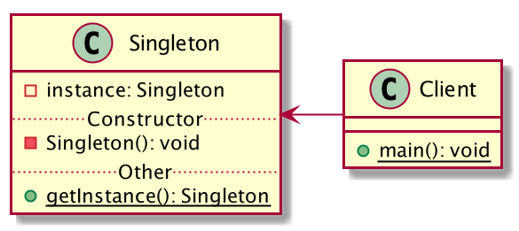

### 2.4 八种实现方式

| 名称                           | 懒加载 | 线程安全 | 优点                                     | 缺点                         | 是否推荐 |
| ------------------------------ | ------ | -------- | ---------------------------------------- | ---------------------------- | -------- |
| 饿汉式（静态常量）             | ✖️      | ✔️        | 类加载时完成实例化，避免了线程安全问题。 | 类加载时就初始化，浪费内存。 | ✖️        |
| 饿汉式（静态代码块）           | ✖️      | ✔️        | 类加载时完成实例化，避免了线程安全问题。 | 类加载时就初始化，浪费内存。 | ✖️        |
| 懒汉式（线程不安全）           | ✔️      | ✖️        | 懒加载，单线程下有用                     | 多线程不安全                 | ✖️        |
| 懒汉式（线程安全，同步方法）   | ✔️      | ✔️        | 解决了线程安全问题                       | 效率低                       | ✖️        |
| 懒汉式（线程安全，同步代码块） | ✔️      | ✔️        | 解决了线程安全问题                       | 效率低                       | ✖️        |
| 双重检查                       | ✔️      | ✔️        | 线程安全，效率高                         | ✖️                            | ✔️        |
| 静态内部类                     | ✔️      | ✔️        | 线程安全，效率高                         | ✖️                            | ✔️        |
| 枚举                           | ✔️      | ✔️        | 线程安全，效率高                         | ✖️                            | ✔️        |

#### 2.4.1 饿汉式（静态常量）

``` java
public class Singleton {
    private static final Singleton INSTANCE = new Singleton();
	
    private Singleton() {
    }

    public static Singleton getInstance() {
        return INSTANCE;
    }
}
```

#### 2.4.2 饿汉式（静态代码块）

```java
public class Singleton {
    private static Singleton instance;

    static {
        instance = new Singleton();
    }

    private Singleton() {
    }

    public static Singleton getInstance() {
        return instance;
    }
}
```

#### 2.4.3 懒汉式（线程不安全）

```java
public class Singleton {
    private static Singleton instance;

    private Singleton() {
    }

    public static Singleton getInstance() {
        return instance == null ? instance = new Singleton() : instance;
    }
}
```

#### 2.4.4 懒汉式（线程安全，同步方法）

```java
public class Singleton {
    private static Singleton instance;

    private Singleton() {
    }

    public synchronized static Singleton getInstance() {
        if (instance == null) {
            instance = new Singleton();
        }

        return instance;
    }
}
```

#### 2.4.5 懒汉式（线程安全，同步代码块）

```java
public class Singleton {
    private static Singleton instance;

    private Singleton() {
    }

    public static Singleton getInstance() {
        if (instance == null) {
            synchronized (Singleton.class) {
                instance = new Singleton();
            }
        }

        return instance;
    }
}
```

#### 2.4.6 双重检查

```java
public class Singleton {
    // volatile: 确保每个线程获得的都是变量的最新状态
    private volatile static Singleton instance;

    private Singleton() {
    }

    public static Singleton getInstance() {
        if (instance == null) {
            synchronized (Singleton.class) {
                if (instance == null) {
                    instance = new Singleton();
                }
            }
        }

        return instance;
    }
}
```

#### 2.4.7 静态内部类

```java
public class Singleton {
    private Singleton() {
    }

    private static class SingletonInner {
        private static final Singleton INSTANCE = new Singleton();
    }

    public static Singleton getInstance() {
        return SingletonInner.INSTANCE;
    }
}
```

#### 2.4.8 枚举

```java
public enum Singleton {
    INSTANCE
}
```

## 第 3 章 工厂方法模式

### 3.1 工厂方法模式

工厂模式（Factory Method Pattern）在创建对象时不会对客户端暴露创建逻辑，并且是通过使用一个共同的接口来指向新创建的对象。

### 3.2 介绍

| 重点     | 说明                                                         |
| -------- | ------------------------------------------------------------ |
| 意图     | 定义一个创建对象的接口，让其子类自己决定实例化哪一个工厂类，工厂模式使其创建过程延迟到子类进行。 |
| 主要解决 | 主要解决接口选择的问题。                                     |
| 何时使用 | 我们明确地计划不同条件下创建不同实例时。                     |
| 如何解决 | 让其子类实现工厂接口，返回的也是一个抽象的产品。             |
| 关键代码 | 创建过程在其子类执行。                                       |
| 应用实例 | 1、您需要一辆汽车，可以直接从工厂里面提货，而不用去管这辆汽车是怎么做出来的，以及这个汽车里面的具体实现。 <br />2、Hibernate 换数据库只需换方言和驱动就可以。 |
| 优点     | 1、一个调用者想创建一个对象，只要知道其名称就可以了。 <br />2、扩展性高，如果想增加一个产品，只要扩展一个工厂类就可以。 <br />3、屏蔽产品的具体实现，调用者只关心产品的接口。 |
| 缺点     | 每次增加一个产品时，都需要增加一个具体类和对象实现工厂，使得系统中类的个数成倍增加，在一定程度上增加了系统的复杂度，同时也增加了系统具体类的依赖。这并不是什么好事。 |
| 使用场景 | 1、日志记录器：记录可能记录到本地硬盘、系统事件、远程服务器等，用户可以选择记录日志到什么地方。 <br />2、数据库访问，当用户不知道最后系统采用哪一类数据库，以及数据库可能有变化时。 <br />3、设计一个连接服务器的框架，需要三个协议，"POP3"、"IMAP"、"HTTP"，可以把这三个作为产品类，共同实现一个接口。 |
| 注意事项 | 作为一种创建类模式，在任何需要生成复杂对象的地方，都可以使用工厂方法模式。有一点需要注意的地方就是复杂对象适合使用工厂模式，而简单对象，特别是只需要通过 new 就可以完成创建的对象，无需使用工厂模式。如果使用工厂模式，就需要引入一个工厂类，会增加系统的复杂度。 |

### 3.3 思路

我们将创建一个 *Shape* 接口和实现 *Shape* 接口的实体类。下一步是定义工厂类 *ShapeFactory*。

*Client* 类使用 *ShapeFactory* 来获取 *Shape* 对象。它将向 *ShapeFactory* 传递信息（*Circle / Square / Rectangle*），以便获取它所需对象的类型。

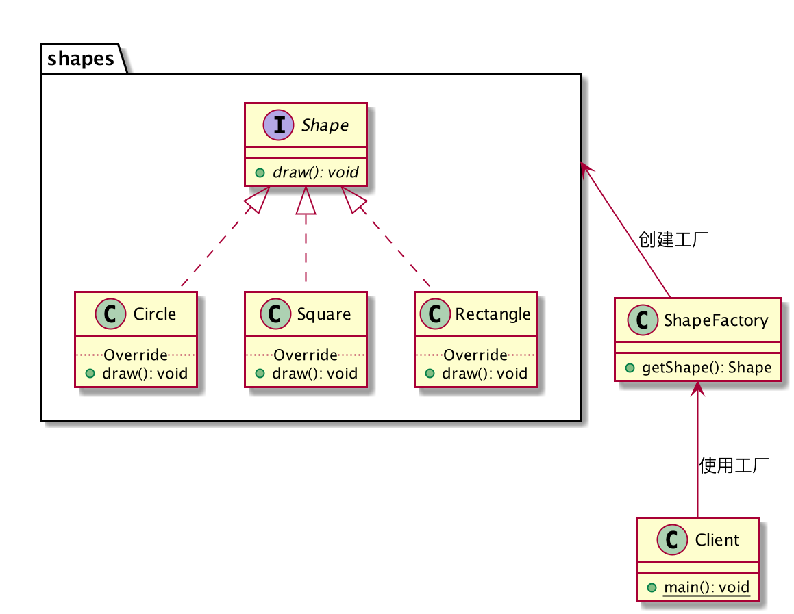

### 3.4 实现

1）创建一个接口。

**shapes/Shape.java**

``` java
public interface Shape {
    void draw();
}
```

2）创建实现接口的实体类。

**shapes/Circle.java**

```java
public class Circle implements Shape {
    @Override
    public void draw() {
        System.out.println("Circle");
    }
}
```

**shapes/Rectangle.java**

```java
public class Rectangle implements Shape {
    @Override
    public void draw() {
        System.out.println("Rectangle");
    }
}
```

**shapes/Square.java**

```java
public class Square implements Shape {
    @Override
    public void draw() {
        System.out.println("Square");
    }
}
```

3）创建一个工厂，生成基于给定信息的实体类的对象。

**ShapeFactory.java**

```java
public class ShapeFactory {
    public static Shape getShape(String name) {
        switch (name) {
            case "Circle":
                return new Circle();
            case "Square":
                return new Square();
            case "Rectangle":
                return new Rectangle();
            default:
                return null;
        }
    }
}
```

4）使用该工厂，通过传递类型信息来获取实体类的对象。

**Client.java**

```java
public class Client {
    public static void main(String[] args) {
        Shape circle = ShapeFactory.getShape("Circle");
        circle.draw();

        Shape square = ShapeFactory.getShape("Square");
        square.draw();

        Shape rectangle = ShapeFactory.getShape("Rectangle");
        rectangle.draw();
    }
}
```

5）结果

``` shell
Circle
Square
Rectangle
```

## 第 4 章 抽象工厂模式

### 4.1 抽象工厂模式

抽象工厂模式（Abstract Factory Pattern）中接口是负责创建一个相关对象的工厂，不需要显式指定它们的类，每个生成的工厂都能按照工厂模式提供对象。

### 4.2 介绍

| 重点     | 说明                                                         |
| -------- | ------------------------------------------------------------ |
| 意图     | 提供一个创建一系列相关或相互依赖对象的接口，而无需指定它们具体的类。 |
| 主要解决 | 主要解决接口选择的问题。                                     |
| 何时使用 | 系统的产品有多于一个的产品族，而系统只消费其中某一族的产品。 |
| 如何解决 | 在一个产品族里面，定义多个产品。                             |
| 关键代码 | 在一个工厂里聚合多个同类产品。                               |
| 应用实例 | 工作了，为了参加一些聚会，肯定有两套或多套衣服吧，比如说有商务装（成套，一系列具体产品）、时尚装（成套，一系列具体产品），甚至对于一个家庭来说，可能有商务女装、商务男装、时尚女装、时尚男装，这些也都是成套的，即一系列具体产品。假设一种情况（现实中是不存在的，要不然，没法进入共产主义了，但有利于说明抽象工厂模式），在您的家中，某一个衣柜（具体工厂）只能存放某一种这样的衣服（成套，一系列具体产品），每次拿这种成套的衣服时也自然要从这个衣柜中取出了。用 OOP 的思想去理解，所有的衣柜（具体工厂）都是衣柜类的（抽象工厂）某一个，而每一件成套的衣服又包括具体的上衣（某一具体产品），裤子（某一具体产品），这些具体的上衣其实也都是上衣（抽象产品），具体的裤子也都是裤子（另一个抽象产品）。 |
| 优点     | 当一个产品族中的多个对象被设计成一起工作时，它能保证客户端始终只使用同一个产品族中的对象。 |
| 缺点     | 产品族扩展非常困难，要增加一个系列的某一产品，既要在抽象的 Creator 里加代码，又要在具体的里面加代码。 |
| 使用场景 | 1、QQ 换皮肤，一整套一起换。 <br />2、生成不同操作系统的程序。 |
| 注意事项 | 产品族难扩展，产品等级易扩展。                               |

### 4.3 思路

我们将创建 *Shape* 和 *Color* 接口和实现这些接口的实体类。下一步是创建抽象工厂类 *AbstractFactory*。接着定义工厂类 *ShapeFactory* 和 *ColorFactory*，这两个工厂类都是扩展了 *AbstractFactory*。然后创建一个工厂创造器/生成器类 *FactoryProducer*。

*AbstractFactoryPatternDemo* 类使用 *FactoryProducer* 来获取 *AbstractFactory* 对象。它将向 *AbstractFactory* 传递形状信息 *Shape*（*Circle / Rectangle / Square*），以便获取它所需对象的类型。同时它还向 *AbstractFactory* 传递颜色信息 *Color*（*Red / Green / Blue*），以便获取它所需对象的类型。

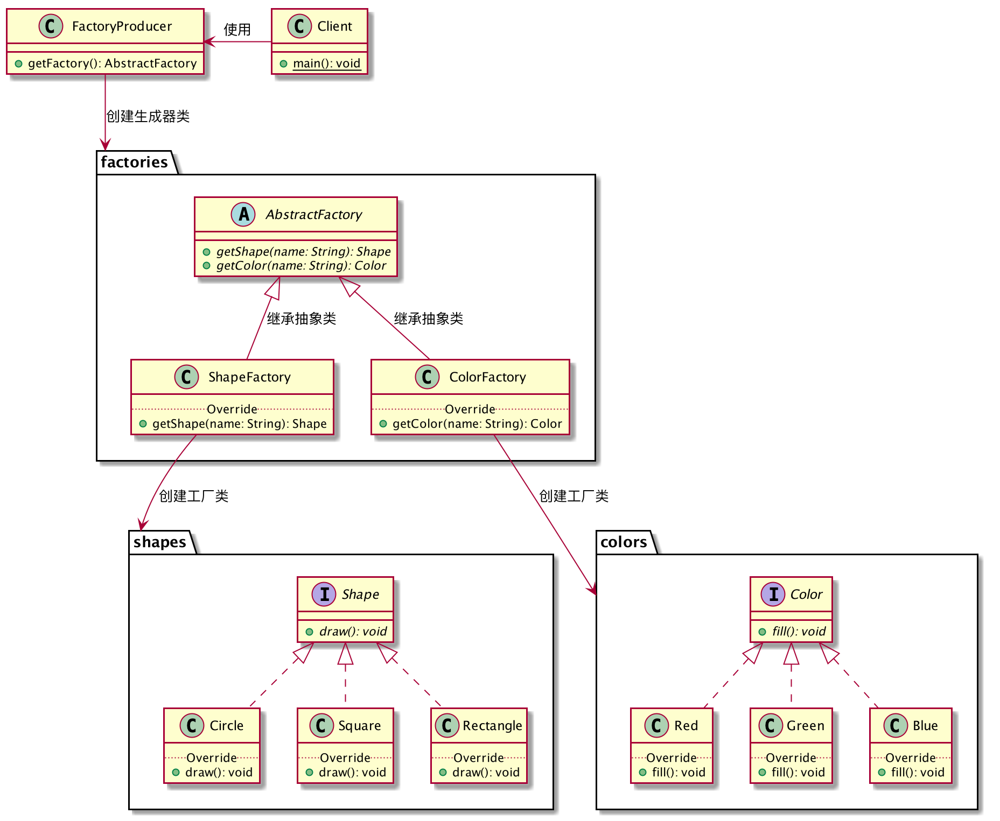

### 4.4 实现

1）为形状创建一个接口。

**shapes/Shape.java**

```java
public interface Shape {
    void draw();
}
```

2）创建实现接口的实体类。

**shapes/Circle.java**

```java
public class Circle implements Shape {
    @Override
    public void draw() {
        System.out.println("Circle");
    }
}
```

**shapes/Rectangle.java**

```java
public class Rectangle implements Shape {
    @Override
    public void draw() {
        System.out.println("Rectangle");
    }
}
```

**shapes/Square.java**

```java
public class Square implements Shape {
    @Override
    public void draw() {
        System.out.println("Square");
    }
}
```

3）为颜色创建一个接口。

**colors/Color.java**

```java
public interface Color {
    void fill();
}
```

4）创建实现接口的实体类。

**colors/Blue.java**

```java
public class Blue implements Color {
    @Override
    public void fill() {
        System.out.println("Blue");
    }
}
```

**colors/Green.java**

```java
public class Green implements Color {
    @Override
    public void fill() {
        System.out.println("Green");
    }
}
```

**colors/Red.java**

```java
public class Red implements Color {
    @Override
    public void fill() {
        System.out.println("Red");
    }
}
```

5）为 Color 和 Shape 对象创建抽象类来获取工厂。

**factories/AbstractFactory.java**

```java
public abstract class AbstractFactory {
    public abstract Shape getShape(String name);

    public abstract Color getColor(String name);
}
```

6）创建扩展了 AbstractFactory 的工厂类，基于给定的信息生成实体类的对象。

**factories/ColorFactory.java**

```java
public class ColorFactory extends AbstractFactory {
    @Override
    public Shape getShape(String name) {
        return null;
    }

    @Override
    public Color getColor(String name) {
        switch (name) {
            case "Blue":
                return new Blue();
            case "Green":
                return new Green();
            case "Red":
                return new Red();
            default:
                return null;
        }
    }
}
```

**factories/ShapeFactory.java**

```java
public class ShapeFactory extends AbstractFactory {
    @Override
    public Shape getShape(String name) {
        switch (name) {
            case "Circle":
                return new Circle();
            case "Rectangle":
                return new Rectangle();
            case "Square":
                return new Square();
            default:
                return null;
        }
    }

    @Override
    public Color getColor(String name) {
        return null;
    }
}
```

7）创建一个工厂创造器/生成器类，通过传递形状或颜色信息来获取工厂。

**FactoryProducer.java**

```java
public class FactoryProducer {
    public static AbstractFactory getFactory(String name) {
        switch (name) {
            case "Shape":
                return new ShapeFactory();
            case "Color":
                return new ColorFactory();
            default:
                return null;
        }
    }
}
```

8）使用 FactoryProducer 来获取 AbstractFactory，通过传递类型信息来获取实体类的对象。

**Client.java**

```java
public class Client {
    public static void main(String[] args) {
        AbstractFactory shapeFactory = FactoryProducer.getFactory("Shape");
        shapeFactory.getShape("Circle").draw();
        shapeFactory.getShape("Square").draw();

        AbstractFactory colorFactory = FactoryProducer.getFactory("Color");
        colorFactory.getColor("Red").fill();
        colorFactory.getColor("Green").fill();
    }
}
```

9）结果

``` shell
Circle
Square
Red
Green
```

## 第 5 章 原型模式

### 5.1 原型模式

原型模式（Prototype Pattern）实现了一个原型接口，该接口用于创建当前对象的克隆。当直接创建对象的代价比较大时，则采用这种模式。

例如，一个对象需要在一个高代价的数据库操作之后被创建。我们可以缓存该对象，在下一个请求时返回它的克隆，在需要的时候更新数据库，以此来减少数据库调用。

### 5.2 介绍

| 重点     | 说明                                                         |
| -------- | ------------------------------------------------------------ |
| 意图     | 用原型实例指定创建对象的种类，并且通过拷贝这些原型创建新的对象。 |
| 主要解决 | 在运行期建立和删除原型。                                     |
| 何时使用 | 1、当一个系统应该独立于它的产品创建，构成和表示时。 <br />2、当要实例化的类是在运行时刻指定时，例如，通过动态装载。 <br />3、为了避免创建一个与产品类层次平行的工厂类层次时。 <br />4、当一个类的实例只能有几个不同状态组合中的一种时。建立相应数目的原型并克隆它们可能比每次用合适的状态手工实例化该类更方便一些。 |
| 如何解决 | 利用已有的一个原型对象，快速地生成和原型对象一样的实例。     |
| 关键代码 | 1、实现克隆操作，在 JAVA 继承 Cloneable，重写 clone()，在 .NET 中可以使用 Object 类的 MemberwiseClone() 方法来实现对象的浅拷贝或通过序列化的方式来实现深拷贝。<br />2、原型模式同样用于隔离类对象的使用者和具体类型（易变类）之间的耦合关系，它同样要求这些"易变类"拥有稳定的接口。 |
| 应用实例 | 1、细胞分裂。 <br />2、JAVA 中的 Object clone() 方法。       |
| 优点     | 1、性能提高。 <br />2、逃避构造函数的约束。                  |
| 缺点     | 1、配备克隆方法需要对类的功能进行通盘考虑，这对于全新的类不是很难，但对于已有的类不一定很容易，特别当一个类引用不支持串行化的间接对象，或者引用含有循环结构的时候。 <br />2、必须实现 Cloneable 接口。 |
| 使用场景 | 1、资源优化场景。 <br />2、类初始化需要消化非常多的资源，这个资源包括数据、硬件资源等。 <br />3、性能和安全要求的场景。 <br />4、通过 new 产生一个对象需要非常繁琐的数据准备或访问权限，则可以使用原型模式。 <br />5、一个对象多个修改者的场景。 <br />6、一个对象需要提供给其他对象访问，而且各个调用者可能都需要修改其值时，可以考虑使用原型模式拷贝多个对象供调用者使用。 <br />7、在实际项目中，原型模式很少单独出现，一般是和工厂方法模式一起出现，通过 clone 的方法创建一个对象，然后由工厂方法提供给调用者。原型模式已经与 Java 融为浑然一体，大家可以随手拿来使用。 |
| 注意事项 | 与通过对一个类进行实例化来构造新对象不同的是，原型模式是通过拷贝一个现有对象生成新对象的。浅拷贝实现 Cloneable，重写，深拷贝是通过实现 Serializable 读取二进制流。 |

### 5.3 思路

我们将创建一个抽象类 *Shape* 和扩展了 *Shape* 类的实体类。下一步是定义类 *ShapeCache*，该类把 shape 对象存储在一个 *HashMap* 中，并在请求的时候返回它们的克隆。

*Client* 类使用 *ShapeCache* 类来获取 *Shape* 对象。

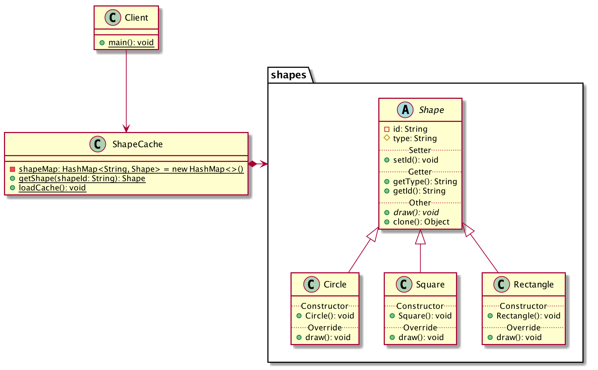

### 5.4 实现

1）创建一个实现了 *Cloneable* 接口的抽象类。

**shapes/Shape.java**

```java
public abstract class Shape {
    private String id;
    protected String type;

    public void setId(String id) {
        this.id = id;
    }

    public String getId() {
        return id;
    }

    public String getType() {
        return type;
    }

    public abstract void draw();

    @Override
    protected Object clone() throws CloneNotSupportedException {
        // 浅拷贝
        // return super.clone();

        // 深拷贝
        ByteArrayInputStream bais = null;
        ByteArrayOutputStream baos = null;
        ObjectInputStream ois = null;
        ObjectOutputStream oos = null;
        try {
            baos = new ByteArrayOutputStream();
            oos = new ObjectOutputStream(baos);
            oos.writeObject(this);

            bais = new ByteArrayInputStream(baos.toByteArray());
            ois = new ObjectInputStream(bais);

            return (Shape) ois.readObject();
        } catch (IOException | ClassNotFoundException e) {
            e.printStackTrace();
            return null;
        } finally {
            try {
                bais.close();
                baos.close();
                ois.close();
                oos.close();
            } catch (Exception e) {
                e.printStackTrace();
            }
        }
    }
}

```

2）创建扩展了上面抽象类的实体类。

**shapes/Circle.java**

```java
public class Circle extends Shape {
    public Circle() {
        type = "Circle";
    }

    @Override
    public void draw() {
        System.out.println("Circle");
    }
}
```

**shapes/Rectangle.java**

```java
public class Rectangle extends Shape {
    public Rectangle() {
        type = "Rectangle";
    }

    @Override
    public void draw() {
        System.out.println("Rectangle");
    }
}
```

**shapes/Square.java**

```java
public class Square extends Shape {
    public Square() {
        type = "Square";
    }

    @Override
    public void draw() {
        System.out.println("Square");
    }
}
```

3）创建一个类，从数据库获取实体类，并把它们存储在一个 *HashMap* 中。

**ShapeCache.java**

```java
public class ShapeCache {
    private static HashMap<String, Shape> shapeMap = new HashMap<>();

    public static Shape getShape(String shapeId) {
        return shapeMap.get(shapeId);
    }

    public static void loadCache() {
        Circle circle = new Circle();
        Rectangle rectangle = new Rectangle();
        Square square = new Square();

        circle.setId("1");
        rectangle.setId("2");
        square.setId("3");

        shapeMap.put(circle.getId(), circle);
        shapeMap.put(rectangle.getId(), rectangle);
        shapeMap.put(square.getId(), square);
    }
}
```

4）*Client* 使用 *ShapeCache* 类来获取存储在 *HashMap* 中的形状的克隆。

**Client.java**

```java
public class Client {
    public static void main(String[] args) {
        ShapeCache.loadCache();

        Circle circle = (Circle) ShapeCache.getShape("1");
        circle.draw();

        Rectangle rectangle = (Rectangle) ShapeCache.getShape("2");
        rectangle.draw();

        Square square = (Square) ShapeCache.getShape("3");
        square.draw();
    }
}
```

5）结果

``` shell
Circle
Rectangle
Square
```

## 第 6 章 建造者模式

### 6.1 建造者模式

建造者模式（Builder Pattern）使用多个简单的对象一步一步构建成一个复杂的对象。

一个 Builder 类会一步一步构造最终的对象，该 Builder 类是独立于其他对象的。

### 6.2 介绍

| 重点     | 说明                                                         |
| -------- | ------------------------------------------------------------ |
| 意图     | 将一个复杂的构建与其表示相分离，使得同样的构建过程可以创建不同的表示。 |
| 主要解决 | 主要解决在软件系统中，有时候面临着"一个复杂对象"的创建工作，其通常由各个部分的子对象用一定的算法构成；由于需求的变化，这个复杂对象的各个部分经常面临着剧烈的变化，但是将它们组合在一起的算法却相对稳定。 |
| 何时使用 | 一些基本部件不会变，而其组合经常变化的时候。                 |
| 如何解决 | 将变与不变分离开。                                           |
| 关键代码 | 建造者：创建和提供实例。<br />导演：管理建造出来的实例的依赖关系。 |
| 应用实例 | 1、去肯德基，汉堡、可乐、薯条、炸鸡翅等是不变的，而其组合是经常变化的，生成出所谓的"套餐"。 <br />2、JAVA 中的 StringBuilder。 |
| 优点     | 1、建造者独立，易扩展。 <br />2、便于控制细节风险。          |
| 缺点     | 1、产品必须有共同点，范围有限制。 <br />2、如内部变化复杂，会有很多的建造类。 |
| 使用场景 | 1、需要生成的对象具有复杂的内部结构。 <br />2、需要生成的对象内部属性本身相互依赖。 |
| 注意事项 | 与工厂模式的区别是：建造者模式更加关注与零件装配的顺序。     |

### 6.3 思路

我们假设一个快餐店的商业案例，其中，一个典型的套餐可以是一个汉堡（Burger）和一杯冷饮（Cold drink）。汉堡（Burger）可以是素食汉堡（Veg Burger）或鸡肉汉堡（Chicken Burger），它们是包在纸盒中。冷饮（Cold drink）可以是可口可乐（coke）或百事可乐（pepsi），它们是装在瓶子中。

我们将创建一个表示食物条目（比如汉堡和冷饮）的 *Item* 接口和实现 *Item* 接口的实体类，以及一个表示食物包装的 *Packing* 接口和实现 *Packing*接口的实体类，汉堡是包在纸盒中，冷饮是装在瓶子中。

然后我们创建一个 *Meal* 类，带有 *Item* 的 *ArrayList* 和一个通过结合 *Item* 来创建不同类型的 *Meal* 对象的 *MealBuilder*。*BuilderPatternDemo* 类使用 *MealBuilder* 来创建一个 *Meal*。

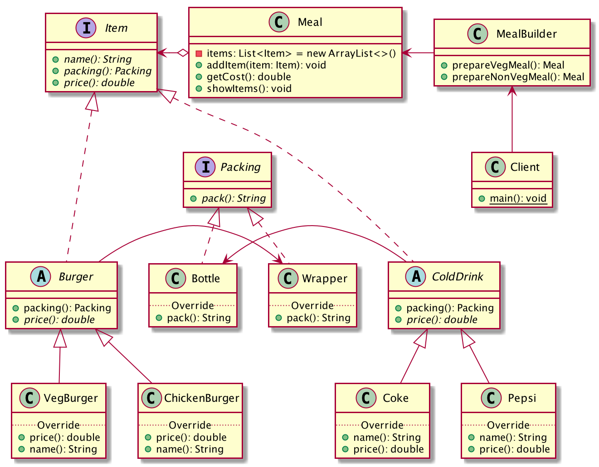

### 6.4 实现

1）创建一个表示食物条目和食物包装的接口。

**Item.java**

```java
public interface Item {
    String name();

    Packing packing();

    double price();
}
```

**Packing.java**

```java
public interface Packing {
    String pack();
}
```

2）创建实现 Packing 接口的实体类。

**Bottle.java**

```java
public class Bottle implements Packing {
    @Override
    public String pack() {
        return "Bottle";
    }
}
```

**Wrapper.java**

```java
public class Wrapper implements Packing {
    @Override
    public String pack() {
        return "Wrapper";
    }
}
```

3）创建实现 Item 接口的抽象类，该类提供了默认的功能。

**Burger.java**

```java
public abstract class Burger implements Item {
    @Override
    public Packing packing() {
        return new Wrapper();
    }

    public abstract double price();

}
```

**ColdDrink.java**

```java
public abstract class ColdDrink implements Item {
    @Override
    public Packing packing() {
        return new Bottle();
    }

    public abstract double price();
}
```

4）创建扩展了 Burger 和 ColdDrink 的实体类。

**VegBurger.java**

```java
public class VegBurger extends Burger {
    @Override
    public String name() {
        return "VegBurger";
    }

    @Override
    public double price() {
        return 12.9;
    }
}
```

**ChickenBurger.java**

```java
public class ChickenBurger extends Burger {
    @Override
    public String name() {
        return "ChickenBurger";
    }

    @Override
    public double price() {
        return 19.3;
    }
}
```

**Coke.java**

```java
public class Coke extends ColdDrink {
    @Override
    public String name() {
        return "Coke";
    }

    @Override
    public double price() {
        return 5.5;
    }
}
```

**Pepsi.java**

```java
public class Pepsi extends ColdDrink {
    @Override
    public String name() {
        return "Pepsi";
    }

    @Override
    public double price() {
        return 9;
    }
}
```

5）创建一个 Meal 类，带有上面定义的 Item 对象。

**Meal.java**

```java
public class Meal {
    private List<Item> items = new ArrayList<>();

    public void addItem(Item item) {
        items.add(item);
    }

    public double getCost() {
        return items.stream().mapToDouble(Item::price).sum();
    }

    public void showItems() {
        items.forEach(i -> {
            System.out.print("Item : " + i.name());
            System.out.print(", Packing : " + i.packing().pack());
            System.out.println(", Price : " + i.price());
        });
    }
}
```

6）创建一个 MealBuilder 类，实际的 builder 类负责创建 Meal 对象。

**MealBuilder.java**

```java
public class MealBuilder {
    public Meal prepareVegMeal() {
        Meal meal = new Meal();
        meal.addItem(new VegBurger());
        meal.addItem(new Coke());
        return meal;
    }

    public Meal prepareNonVegMeal() {
        Meal meal = new Meal();
        meal.addItem(new ChickenBurger());
        meal.addItem(new Pepsi());
        return meal;
    }
}
```

7）BuiderPatternDemo 使用 MealBuider 来演示建造者模式（Builder Pattern）。

**Client.java**

```java
public class Client {
    public static void main(String[] args) {
        MealBuilder mealBuilder = new MealBuilder();

        Meal vegMeal = mealBuilder.prepareVegMeal();
        System.out.println("Veg Meal");
        vegMeal.showItems();
        System.out.println("Total Cost: " + vegMeal.getCost());

        Meal nonVegMeal = mealBuilder.prepareNonVegMeal();
        System.out.println("\n\nNon-Veg Meal");
        nonVegMeal.showItems();
        System.out.println("Total Cost: " + nonVegMeal.getCost());
    }
}
```

8）结果

``` shell
Veg Meal
Item : VegBurger, Packing : Wrapper, Price : 12.9
Item : Coke, Packing : Bottle, Price : 5.5
Total Cost: 18.4


Non-Veg Meal
Item : ChickenBurger, Packing : Wrapper, Price : 19.3
Item : Pepsi, Packing : Bottle, Price : 9.0
Total Cost: 28.3
```

## 第 7 章 适配器模式

### 7.1 适配器模式

适配器模式（Adapter Pattern）作为两个不兼容的接口之间的桥梁，结合了两个独立接口的功能。

这种模式涉及到一个单一的类，该类负责加入独立的或不兼容的接口功能。举个真实的例子，读卡器是作为内存卡和笔记本之间的适配器。您将内存卡插入读卡器，再将读卡器插入笔记本，这样就可以通过笔记本来读取内存卡。

我们通过下面的实例来演示适配器模式的使用。其中，音频播放器设备只能播放 mp3 文件，通过使用一个更高级的音频播放器来播放 vlc 和 mp4 文件。

### 7.2 介绍

| 重点     | 说明                                                         |
| -------- | ------------------------------------------------------------ |
| 意图     | 将一个类的接口转换成客户希望的另外一个接口。适配器模式使得原本由于接口不兼容而不能一起工作的那些类可以一起工作。 |
| 主要解决 | 主要解决在软件系统中，常常要将一些"现存的对象"放到新的环境中，而新环境要求的接口是现对象不能满足的。 |
| 何时使用 | 1、系统需要使用现有的类，而此类的接口不符合系统的需要。 <br />2、想要建立一个可以重复使用的类，用于与一些彼此之间没有太大关联的一些类，包括一些可能在将来引进的类一起工作，这些源类不一定有一致的接口。 <br />3、通过接口转换，将一个类插入另一个类系中。（比如老虎和飞禽，现在多了一个飞虎，在不增加实体的需求下，增加一个适配器，在里面包容一个虎对象，实现飞的接口。） |
| 如何解决 | 继承或依赖（推荐）。                                         |
| 关键代码 | 适配器继承或依赖已有的对象，实现想要的目标接口。             |
| 应用实例 | 1、美国电器 110V，中国 220V，就要有一个适配器将 110V 转化为 220V。 <br />2、JAVA JDK 1.1 提供了 Enumeration 接口，而在 1.2 中提供了 Iterator 接口，想要使用 1.2 的 JDK，则要将以前系统的 Enumeration 接口转化为 Iterator 接口，这时就需要适配器模式。 <br />3、在 LINUX 上运行 WINDOWS 程序。 4、JAVA 中的 jdbc。 |
| 优点     | 1、可以让任何两个没有关联的类一起运行。 <br />2、提高了类的复用。 <br />3、增加了类的透明度。 <br />4、灵活性好。 |
| 缺点     | 1、过多地使用适配器，会让系统非常零乱，不易整体进行把握。比如，明明看到调用的是 A 接口，其实内部被适配成了 B 接口的实现，一个系统如果太多出现这种情况，无异于一场灾难。因此如果不是很有必要，可以不使用适配器，而是直接对系统进行重构。 <br />2由于 JAVA 至多继承一个类，所以至多只能适配一个适配者类，而且目标类必须是抽象类。 |
| 使用场景 | 有动机地修改一个正常运行的系统的接口，这时应该考虑使用适配器模式。 |
| 注意事项 | 适配器不是在详细设计时添加的，而是解决正在服役的项目的问题。 |

### 7.3 思路

我们有一个 *MediaPlayer* 接口和一个实现了 *MediaPlayer* 接口的实体类 *AudioPlayer*。默认情况下，*AudioPlayer* 可以播放 mp3 格式的音频文件。

我们还有另一个接口 *AdvancedMediaPlayer* 和实现了 *AdvancedMediaPlayer* 接口的实体类。该类可以播放 vlc 和 mp4 格式的文件。

我们想要让 *AudioPlayer* 播放其他格式的音频文件。为了实现这个功能，我们需要创建一个实现了 *MediaPlayer* 接口的适配器类 *MediaAdapter*，并使用 *AdvancedMediaPlayer* 对象来播放所需的格式。

*AudioPlayer* 使用适配器类 *MediaAdapter* 传递所需的音频类型，不需要知道能播放所需格式音频的实际类。*AdapterPatternDemo* 类使用 *AudioPlayer* 类来播放各种格式。

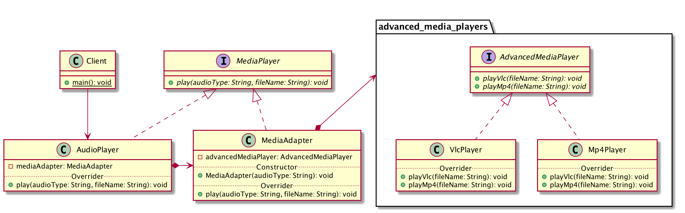

### 7.4 实现

1）为媒体播放器和更高级的媒体播放器创建接口。

**MediaPlayer.java**

```java
public interface MediaPlayer {
    void play(String audioType, String fileName);
}
```

**AdvancedMediaPlayer.java**

```java
public interface AdvancedMediaPlayer {
    void playVlc(String fileName);

    void playMp4(String fileName);
}
```

2）创建实现了 *AdvancedMediaPlayer* 接口的实体类。

**VlcPlayer.java**

```java
public class VlcPlayer implements AdvancedMediaPlayer {
    @Override
    public void playVlc(String fileName) {
        System.out.printf("playVlc-%s\n", fileName);
    }

    @Override
    public void playMp4(String fileName) {
        return;
    }
}
```

**Mp4Player.java**

```java
public class Mp4Player implements AdvancedMediaPlayer {
    @Override
    public void playVlc(String fileName) {
        return;
    }

    @Override
    public void playMp4(String fileName) {
        System.out.printf("playMp4-%s\n", fileName);
    }
}
```

3）创建实现了 *MediaPlayer* 接口的适配器类。

**MediaAdapter.java**

```java
public class MediaAdapter implements MediaPlayer {
    private AdvancedMediaPlayer advancedMediaPlayer;

    public MediaAdapter() {
    }

    @Override
    public void play(String audioType, String fileName) {
        switch (audioType) {
            case "mp4":
                advancedMediaPlayer = new Mp4Player();
                advancedMediaPlayer.playMp4(fileName);
                break;
            case "vlc":
                advancedMediaPlayer = new VlcPlayer();
                advancedMediaPlayer.playVlc(fileName);
                break;
            default:
                System.out.println("无法播放此格式文件");
        }
    }
}
```

4）创建实现了 *MediaPlayer* 接口的实体类。

**AudioPlayer.java**

```java
public class AudioPlayer implements MediaPlayer {

    private MediaAdapter mediaAdapter;

    @Override
    public void play(String audioType, String fileName) {
        if (audioType.equals("mp3")) {
            System.out.println("mp3播放中...");
        } else {
            mediaAdapter = new MediaAdapter();
            mediaAdapter.play(audioType, fileName);
        }
    }
}
```

5）使用 AudioPlayer 来播放不同类型的音频格式。

**Client.java**

```java
public class Client {
    public static void main(String[] args) {
        AudioPlayer audioPlayer = new AudioPlayer();
        audioPlayer.play("mp4", "1.mp4");
        audioPlayer.play("mp3", "2.mp3");
        audioPlayer.play("vlc", "3.vlc");
        audioPlayer.play("vlc2", "4.vlc");
    }
}
```

6）结果

``` shell
playMp4-1.mp4
mp3播放中...
playVlc-3.vlc
无法播放此格式文件
```

## 第 8 章 桥接模式

### 8.1 桥接模式

桥接（Bridge）属于结构型模式，它通过提供抽象化和实现化之间的桥接结构，来实现二者的解耦。涉及到一个作为桥接的接口，使得实体类的功能独立于接口实现类，这两种类型的类可被结构化改变而互不影响。

### 8.2 介绍

| 重点     | 说明                                                         |
| -------- | ------------------------------------------------------------ |
| 意图     | 将抽象部分与实现部分分离，使它们都可以独立的变化。           |
| 主要解决 | 在有多种可能会变化的情况下，用继承会造成类爆炸问题，扩展起来不灵活。 |
| 何时使用 | 实现系统可能有多个角度分类，每一种角度都可能变化。           |
| 如何解决 | 把这种多角度分类分离出来，让它们独立变化，减少它们之间耦合。 |
| 关键代码 | 抽象类依赖实现类。                                           |
| 应用实例 | 1、猪八戒从天蓬元帅转世投胎到猪，转世投胎的机制将尘世划分为两个等级，即：灵魂和肉体，前者相当于抽象化，后者相当于实现化。生灵通过功能的委派，调用肉体对象的功能，使得生灵可以动态地选择。 <br />2、墙上的开关，可以看到的开关是抽象的，不用管里面具体怎么实现的。 |
| 优点     | 1、抽象和实现的分离。 <br />2、优秀的扩展能力。 <br />3、实现细节对客户透明。 |
| 缺点     | 桥接模式的引入会增加系统的理解与设计难度，由于聚合关联关系建立在抽象层，要求开发者针对抽象进行设计与编程。 |
| 使用场景 | 1、如果一个系统需要在构件的抽象化角色和具体化角色之间增加更多的灵活性，避免在两个层次之间建立静态的继承联系，通过桥接模式可以使它们在抽象层建立一个关联关系。 <br />2、对于那些不希望使用继承或因为多层次继承导致系统类的个数急剧增加的系统，桥接模式尤为适用。 <br />3、一个类存在两个独立变化的维度，且这两个维度都需要进行扩展。 |
| 注意事项 | 对于两个独立变化的维度，使用桥接模式再适合不过了。           |

### 8.3 思路

我们有一个作为桥接实现的 *DrawAPI* 接口和实现了 *DrawAPI* 接口的实体类 *RedCircle*、*GreenCircle*。*Shape* 是一个抽象类，将使用 *DrawAPI* 的对象。*Client* 类使用 *Shape* 类来画出不同颜色的圆。

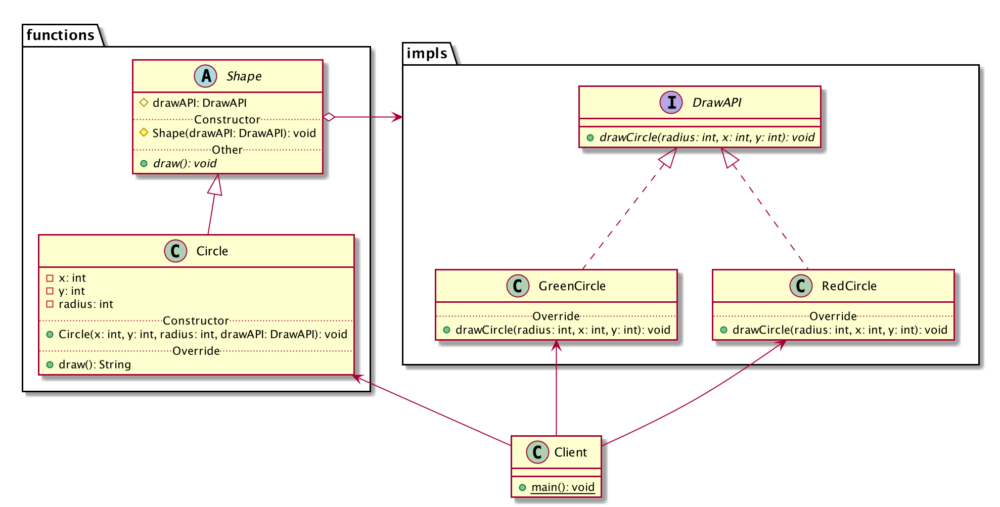

### 8.4 实现

1）创建桥接实现接口。

**impls/DrawAPI.java**

```java
public interface DrawAPI {
    void drawCircle(int radius, int x, int y);
}
```

2）创建实现了 *DrawAPI* 接口的实体桥接实现类。

**impls/GreenCircle.java**

```java
public class GreenCircle implements DrawAPI {
    @Override
    public void drawCircle(int radius, int x, int y) {
        System.out.println("GreenCircle");
    }
}
```

**impls/RedCircle.java**

```java
public class RedCircle implements DrawAPI {
    @Override
    public void drawCircle(int radius, int x, int y) {
        System.out.println("RedCircle");
    }
}
```

3）使用 *DrawAPI* 接口创建抽象类 *Shape*。

**functions/Shape.java**

```java
public abstract class Shape {
    protected DrawAPI drawAPI;

    public Shape(DrawAPI drawAPI) {
        this.drawAPI = drawAPI;
    }

    public abstract void draw();
}
```

4）创建实现了 *Shape* 接口的实体类。

**functions/Circle.java**

```java
public class Circle extends Shape {
    private int x;
    private int y;
    private int radius;

    public Circle(int x, int y, int radius, DrawAPI drawAPI) {
        super(drawAPI);
        this.x = x;
        this.y = y;
        this.radius = radius;
    }

    @Override
    public void draw() {
        drawAPI.drawCircle(radius, x, y);
    }
    
}
```

5）使用 *Shape* 和 *DrawAPI* 类画出不同颜色的圆。

**Client.java**

```java
public class Client {
    public static void main(String[] args) {
        Circle circle1 = new Circle(10, 20, 5, new RedCircle());
        Circle circle2 = new Circle(10, 20, 5, new GreenCircle());

        circle1.draw();
        circle2.draw();
    }
}
```

6）结果

``` java
RedCircle
GreenCircle
```

## 第 9 章 组合模式

### 9.1 组合模式

组合模式（Composite Pattern），又叫部分整体模式，是用于把一组相似的对象当作一个单一的对象。组合模式依据树形结构来组合对象，用来表示部分以及整体层次。

这种模式创建了一个包含自己对象组的类。该类提供了修改相同对象组的方式。

### 9.2 介绍

| 重点     | 说明                                                         |
| -------- | ------------------------------------------------------------ |
| 意图     | 将对象组合成树形结构以表示"部分-整体"的层次结构。组合模式使得用户对单个对象和组合对象的使用具有一致性。 |
| 主要解决 | 它在我们树型结构的问题中，模糊了简单元素和复杂元素的概念，客户程序可以像处理简单元素一样来处理复杂元素，从而使得客户程序与复杂元素的内部结构解耦。 |
| 何时使用 | 1、您想表示对象的部分-整体层次结构（树形结构）。 <br />2、您希望用户忽略组合对象与单个对象的不同，用户将统一地使用组合结构中的所有对象。 |
| 如何解决 | 树枝和叶子实现统一接口，树枝内部组合该接口。                 |
| 关键代码 | 树枝内部组合该接口，并且含有内部属性 List，里面放 Component。 |
| 应用实例 | 1、算术表达式包括操作数、操作符和另一个操作数，其中，另一个操作符也可以是操作数、操作符和另一个操作数。 <br />2、在 JAVA AWT 和 SWING 中，对于 Button 和 Checkbox 是树叶，Container 是树枝。 |
| 优点     | 1、高层模块调用简单。 <br />2、节点自由增加。                |
| 缺点     | 在使用组合模式时，其叶子和树枝的声明都是实现类，而不是接口，违反了依赖倒置原则。 |
| 使用场景 | 部分、整体场景，如树形菜单，文件、文件夹的管理。             |
| 注意事项 | 定义时为具体类。                                             |

### 9.3 思路

我们有一个类 *Employee*，该类被当作组合模型类。*Client* 类使用 *Employee* 类来添加部门层次结构，并打印所有员工。

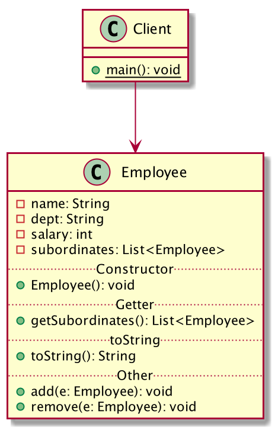

### 9.4 实现

1）创建 *Employee* 类，该类带有 *Employee* 对象的列表。

**Employee.java**

```java
public class Employee {
    private String name;
    private String dept;
    private int salary;
    private List<Employee> subordinates;

    public Employee(String name, String dept, int sal) {
        this.name = name;
        this.dept = dept;
        this.salary = sal;
        subordinates = new ArrayList<>();
    }

    public void add(Employee e) {
        subordinates.add(e);
    }

    public void remove(Employee e) {
        subordinates.remove(e);
    }

    public List<Employee> getSubordinates() {
        return subordinates;
    }

    public String toString() {
        return ("Employee :[ Name : " + name
                + ", dept : " + dept + ", salary :"
                + salary + " ]");
    }
}
```

2）使用 *Employee* 类来创建和打印员工的层次结构。

**Client.java**

```java
public class Client {
    public static void main(String[] args) {
        Employee CEO = new Employee("John", "CEO", 30000);

        Employee headSales = new Employee("Robert", "Head Sales", 20000);

        Employee headMarketing = new Employee("Michel", "Head Marketing", 20000);

        Employee clerk1 = new Employee("Laura", "Marketing", 10000);
        Employee clerk2 = new Employee("Bob", "Marketing", 10000);

        Employee salesExecutive1 = new Employee("Richard", "Sales", 10000);
        Employee salesExecutive2 = new Employee("Rob", "Sales", 10000);

        CEO.add(headSales);
        CEO.add(headMarketing);

        headSales.add(salesExecutive1);
        headSales.add(salesExecutive2);

        headMarketing.add(clerk1);
        headMarketing.add(clerk2);

        // 打印该组织的所有员工
        System.out.println(CEO);
        for (Employee headEmployee : CEO.getSubordinates()) {
            System.out.println(headEmployee);
            for (Employee employee : headEmployee.getSubordinates()) {
                System.out.println(employee);
            }
        }
    }
}
```

3）结果

``` shell
Employee :[ Name : John, dept : CEO, salary :30000 ]
Employee :[ Name : Robert, dept : Head Sales, salary :20000 ]
Employee :[ Name : Richard, dept : Sales, salary :10000 ]
Employee :[ Name : Rob, dept : Sales, salary :10000 ]
Employee :[ Name : Michel, dept : Head Marketing, salary :20000 ]
Employee :[ Name : Laura, dept : Marketing, salary :10000 ]
Employee :[ Name : Bob, dept : Marketing, salary :10000 ]
```

## 第 10 章 装饰器模式

### 10.1 装饰器模式

装饰器模式（Decorator Pattern）允许向一个现有的对象添加新的功能，同时又不改变其结构。

这种模式创建了一个装饰类，用来包装原有的类，并在保持类方法签名完整性的前提下，提供了额外的功能。

### 10.2 介绍

| 重点     | 说明                                                         |
| -------- | ------------------------------------------------------------ |
| 意图     | 动态地给一个对象添加一些额外的职责。就增加功能来说，装饰器模式相比生成子类更为灵活。 |
| 主要解决 | 一般的，我们为了扩展一个类经常使用继承方式实现，由于继承为类引入静态特征，并且随着扩展功能的增多，子类会很膨胀。 |
| 何时使用 | 在不想增加很多子类的情况下扩展类。                           |
| 如何解决 | 将具体功能职责划分，同时继承装饰者模式。                     |
| 关键代码 | 1、Component 类充当抽象角色，不应该具体实现。 <br />2、修饰类引用和继承 Component 类，具体扩展类重写父类方法。 |
| 应用实例 | 1、孙悟空有 72 变，当他变成"庙宇"后，他的根本还是一只猴子，但是他又有了庙宇的功能。 <br />2、不论一幅画有没有画框都可以挂在墙上，但是通常都是有画框的，并且实际上是画框被挂在墙上。在挂在墙上之前，画可以被蒙上玻璃，装到框子里；这时画、玻璃和画框形成了一个物体。 |
| 优点     | 装饰类和被装饰类可以独立发展，不会相互耦合，装饰模式是继承的一个替代模式，装饰模式可以动态扩展一个实现类的功能。 |
| 缺点     | 多层装饰比较复杂。                                           |
| 使用场景 | 1、扩展一个类的功能。 <br />2、动态增加功能，动态撤销。      |
| 注意事项 | 可代替继承。                                                 |

### 10.3 思路

我们将创建一个 *Shape* 接口和实现了 *Shape* 接口的实体类。然后我们创建一个实现了 *Shape* 接口的抽象装饰类 *ShapeDecorator*，并把 *Shape* 对象作为它的实例变量。

*RedShapeDecorator* 是实现了 *ShapeDecorator* 的实体类。

*Client* 类使用 *RedShapeDecorator* 来装饰 *Shape* 对象。

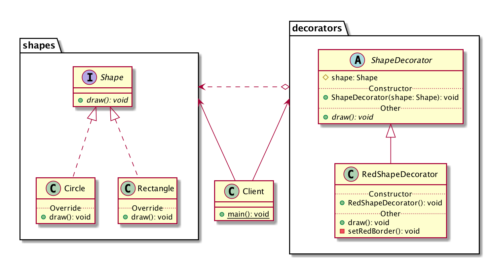

### 10.4 实现

1）创建一个接口。

**shapes/Shape.java**

```java
public interface Shape {
    void draw();
}
```

2）创建实现接口的实体类。

**shapes/Circle.java**

```java
public class Circle implements Shape {
    @Override
    public void draw() {
        System.out.println("Circle");
    }
}
```

**shapes/Rectangle.java**

```java
public class Rectangle implements Shape {
    @Override
    public void draw() {
        System.out.println("Rectangle");
    }
}
```

3）创建实现了 *Shape* 接口的抽象装饰类。

**decorators/ShapeDecorator.java**

```java
public abstract class ShapeDecorator implements Shape {
    protected Shape shape;

    public ShapeDecorator(Shape shape) {
        this.shape = shape;
    }

    public abstract void draw();
}
```

4）创建扩展了 *ShapeDecorator* 类的实体装饰类。

**decorators/RedShapeDecorator.java**

```java
public class RedShapeDecorator extends ShapeDecorator {
    public RedShapeDecorator(Shape shape) {
        super(shape);
    }

    @Override
    public void draw() {
        shape.draw();
        setRedBorder();
    }

    private void setRedBorder() {
        System.out.println("增加红色边框");
    }
}
```

5）使用 *RedShapeDecorator* 来装饰 *Shape* 对象。

**Client.java**

```java
public class Client {
    public static void main(String[] args) {
        RedShapeDecorator redShapeDecorator1 = new RedShapeDecorator(new Circle());
        RedShapeDecorator redShapeDecorator2 = new RedShapeDecorator(new Rectangle());

        redShapeDecorator1.draw();
        redShapeDecorator2.draw();
    }
}
```

6）结果

``` shell
Circle
增加红色边框
Rectangle
增加红色边框
```

## 第 11 章 外观模式

### 11.1 外观模式

外观模式（Facade Pattern）隐藏系统的复杂性，并向客户端提供了一个客户端可以访问系统的接口。

这种模式涉及到一个单一的类，该类提供了客户端请求的简化方法和对现有系统类方法的委托调用。

### 11.2 介绍

| 重点     | 说明                                                         |
| -------- | ------------------------------------------------------------ |
| 意图     | 为子系统中的一组接口提供一个一致的界面，外观模式定义了一个高层接口，这个接口使得这一子系统更加容易使用。 |
| 主要解决 | 降低访问复杂系统的内部子系统时的复杂度，简化客户端与之的接口。 |
| 何时使用 | 1、客户端不需要知道系统内部的复杂联系，整个系统只需提供一个"接待员"即可。 <br />2、定义系统的入口。 |
| 如何解决 | 客户端不与系统耦合，外观类与系统耦合。                       |
| 关键代码 | 在客户端和复杂系统之间再加一层，这一层将调用顺序、依赖关系等处理好。 |
| 应用实例 | 1、去医院看病，可能要去挂号、门诊、划价、取药，让患者或患者家属觉得很复杂，如果有提供接待人员，只让接待人员来处理，就很方便。 <br />2、JAVA 的三层开发模式。 |
| 优点     | 1、减少系统相互依赖。 <br />2、提高灵活性。 <br />3、提高了安全性。 |
| 缺点     | 不符合开闭原则，如果要改东西很麻烦，继承重写都不合适。       |
| 使用场景 | 1、为复杂的模块或子系统提供外界访问的模块。 <br />2、子系统相对独立。 <br />3、预防低水平人员带来的风险。 |
| 注意事项 | 在层次化结构中，可以使用外观模式定义系统中每一层的入口。     |

### 11.3 思路

我们将创建一个 *Shape* 接口和实现了 *Shape* 接口的实体类。下一步是定义一个外观类 *ShapeMaker*。

*ShapeMaker* 类使用实体类来代表用户对这些类的调用。*FacadePatternDemo* 类使用 *ShapeMaker* 类来显示结果。

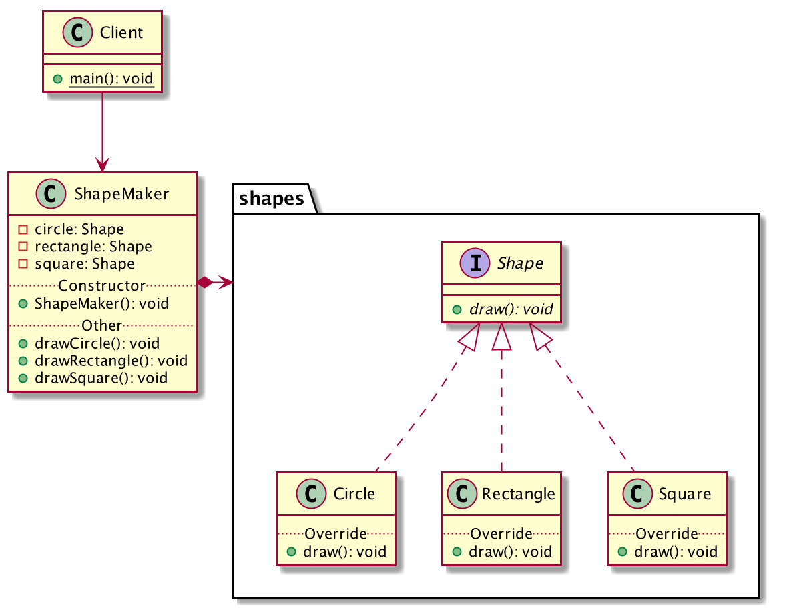

### 11.4 实现

1）创建一个接口。

**shapes/Shape.java**

```java
public interface Shape {
    void draw();
}
```

2）创建实现接口的实体类。

**shapes/Circle.java**

```java
public class Circle implements Shape {
    @Override
    public void draw() {
        System.out.println("Circle");
    }
}
```

**shapes/Rectangle.java**

```java
public class Rectangle implements Shape {
    @Override
    public void draw() {
        System.out.println("Rectangle");
    }
}
```

**shapes/Square.java**

```java
public class Square implements Shape {
    @Override
    public void draw() {
        System.out.println("Square");
    }
}
```

3）创建一个外观类。

**ShapeMaker.java**

```java
public class ShapeMaker {
    private Shape circle;
    private Shape rectangle;
    private Shape square;

    public ShapeMaker() {
        circle = new Circle();
        rectangle = new Rectangle();
        square = new Square();
    }

    public void drawCircle() {
        circle.draw();
    }

    public void drawRectangle() {
        rectangle.draw();
    }

    public void drawSquare() {
        square.draw();
    }
}
```

4）使用该外观类画出各种类型的形状。

**Client.java**

```java
public class Client {
    public static void main(String[] args) {
        ShapeMaker shapeMaker = new ShapeMaker();
        shapeMaker.drawCircle();
        shapeMaker.drawRectangle();
        shapeMaker.drawSquare();
    }
}
```

5）结果

``` java
Circle
Rectangle
Square
```

## 第 12 章 享元模式

### 12.1 享元模式

享元模式（Flyweight Pattern）主要用于减少创建对象的数量，以减少内存占用和提高性能。

享元模式尝试重用现有的同类对象，如果未找到匹配的对象，则创建新对象。

### 12.2 介绍

| 重点     | 说明                                                         |
| -------- | ------------------------------------------------------------ |
| 意图     | 运用共享技术有效地支持大量细粒度的对象。                     |
| 主要解决 | 在有大量对象时，有可能会造成内存溢出，我们把其中共同的部分抽象出来，如果有相同的业务请求，直接返回在内存中已有的对象，避免重新创建。 |
| 何时使用 | 1、系统中有大量对象。 <br />2、这些对象消耗大量内存。 <br />3、这些对象的状态大部分可以外部化。 <br />4、这些对象可以按照内蕴状态分为很多组，当把外蕴对象从对象中剔除出来时，每一组对象都可以用一个对象来代替。<br />5、系统不依赖于这些对象身份，这些对象是不可分辨的。 |
| 如何解决 | 用唯一标识码判断，如果在内存中有，则返回这个唯一标识码所标识的对象。 |
| 关键代码 | 用 HashMap 存储这些对象。                                    |
| 应用实例 | 1、JAVA 中的 String，如果有则返回，如果没有则创建一个字符串保存在字符串缓存池里面。 <br />2、数据库的数据池。 |
| 优点     | 大大减少对象的创建，降低系统的内存，使效率提高。             |
| 缺点     | 提高了系统的复杂度，需要分离出外部状态和内部状态，而且外部状态具有固有化的性质，不应该随着内部状态的变化而变化，否则会造成系统的混乱。 |
| 使用场景 | 1、系统有大量相似对象。 2、需要缓冲池的场景。                |
| 注意事项 | 1、注意划分外部状态和内部状态，否则可能会引起线程安全问题。 <br />2、这些类必须有一个工厂对象加以控制。 |

### 12.3 思路

我们将创建一个 *Shape* 接口和实现了 *Shape* 接口的实体类 *Circle*。下一步是定义工厂类 *ShapeFactory*。

*ShapeFactory* 有一个 *Circle* 的 *HashMap*，其中键名为 *Circle* 对象的颜色。无论何时接收到请求，都会创建一个特定颜色的圆。*ShapeFactory* 检查它的 *HashMap* 中的 circle 对象，如果找到 *Circle* 对象，则返回该对象，否则将创建一个存储在 hashmap 中以备后续使用的新对象，并把该对象返回到客户端。

*Client* 类使用 *ShapeFactory* 来获取 *Shape* 对象。它将向 *ShapeFactory* 传递信息（*red / green / blue/ black / white*），以便获取它所需对象的颜色。

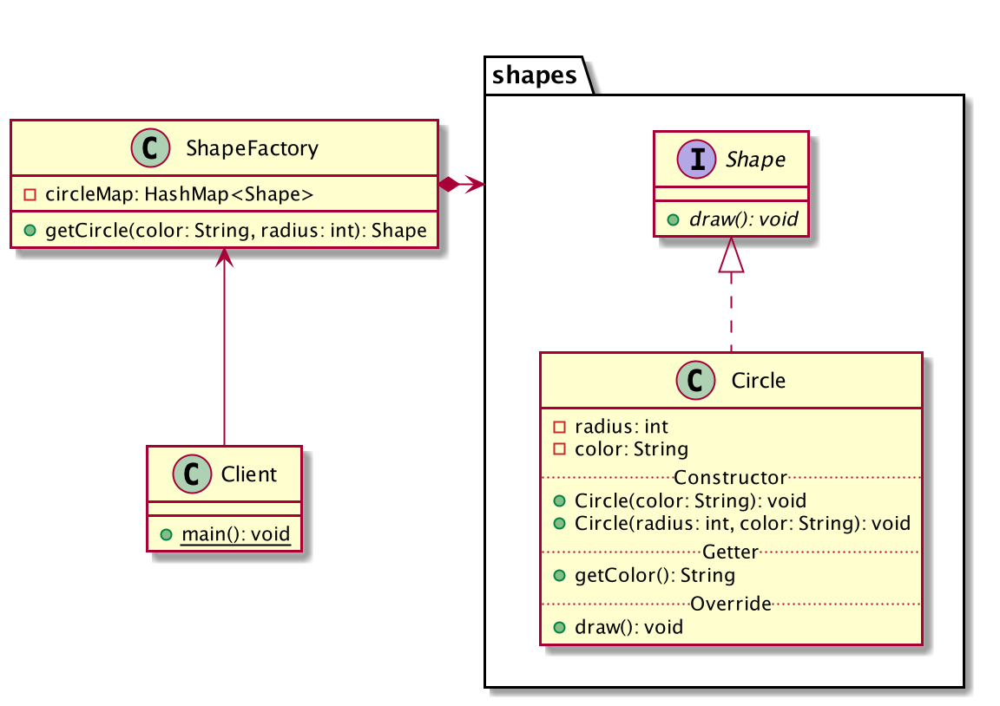

### 12.4 实现

1）创建一个接口。

**shapes/Shape.java**

```java
public interface Shape {
    void draw();
}
```

2）创建实现接口的实体类。

**shapes/Circle.java**

```java
public class Circle implements Shape {
    private int radius;
    private String color;

    public Circle(String color) {
        this.color = color;
    }

    public Circle(int radius, String color) {
        this.radius = radius;
        this.color = color;
    }

    public String getColor() {
        return color;
    }

    @Override
    public void draw() {
        System.out.printf("Circle{radius=%d, color=%s}\n", radius, color);
    }
}
```

3）创建一个工厂，生成基于给定信息的实体类的对象。

**ShapeFactory.java**

```java
public class ShapeFactory {
    private Map<String, Shape> circleMap;

    public ShapeFactory() {
        circleMap = new HashMap<>();

        Circle circle1 = new Circle(10, "red");
        Circle circle2 = new Circle(9, "green");
        Circle circle3 = new Circle(19, "blue");
        Circle circle4 = new Circle(23, "black");
        Circle circle5 = new Circle(6, "white");

        circleMap.put(circle1.getColor(), circle1);
        circleMap.put(circle2.getColor(), circle2);
        circleMap.put(circle3.getColor(), circle3);
        circleMap.put(circle4.getColor(), circle4);
        circleMap.put(circle5.getColor(), circle5);
    }

    public Circle getCircle(String color) {
        Circle circle = (Circle) circleMap.get(color);
        return circle == null ? (Circle) circleMap.put(color, new Circle(color)) : circle;
    }
}
```

4）使用该工厂，通过传递颜色信息来获取实体类的对象。

**Client.java**

```java
public class Client {
    public static void main(String[] args) {
        ShapeFactory shapeFactory = new ShapeFactory();

        Circle circle1 = shapeFactory.getCircle("red");
        circle1.draw();

        Circle circle2 = shapeFactory.getCircle("blue");
        circle2.draw();
    }
}
```

5）结果

``` shell
Circle{radius=10, color=red}
Circle{radius=19, color=blue}
```

## 第 13 章 代理模式

### 13.1 代理模式

在代理模式（Proxy Pattern）中，一个类代表另一个类的功能。创建具有现有对象的对象，以便向外界提供功能接口。

### 13.2 介绍

| 重点     | 说明                                                         |
| -------- | ------------------------------------------------------------ |
| 意图     | 为其他对象提供一种代理以控制对这个对象的访问。               |
| 主要解决 | 在直接访问对象时带来的问题，比如说：要访问的对象在远程的机器上。在面向对象系统中，有些对象由于某些原因（比如对象创建开销很大，或者某些操作需要安全控制，或者需要进程外的访问），直接访问会给使用者或者系统结构带来很多麻烦，我们可以在访问此对象时加上一个对此对象的访问层。 |
| 何时使用 | 想在访问一个类时做一些控制。                                 |
| 如何解决 | 增加中间层。                                                 |
| 关键代码 | 实现与被代理类组合。                                         |
| 应用实例 | 1、Windows 里面的快捷方式。 <br />2、猪八戒去找高翠兰结果是孙悟空变的，可以这样理解：把高翠兰的外貌抽象出来，高翠兰本人和孙悟空都实现了这个接口，猪八戒访问高翠兰的时候看不出来这个是孙悟空，所以说孙悟空是高翠兰代理类。 <br />3、买火车票不一定在火车站买，也可以去代售点。 <br />4、一张支票或银行存单是账户中资金的代理。支票在市场交易中用来代替现金，并提供对签发人账号上资金的控制。 <br />5、spring aop。 |
| 优点     | 1、职责清晰。 <br />2、高扩展性。 <br />3、智能化。          |
| 缺点     | 1、由于在客户端和真实主题之间增加了代理对象，因此有些类型的代理模式可能会造成请求的处理速度变慢。 2、实现代理模式需要额外的工作，有些代理模式的实现非常复杂。 |
| 使用场景 | 按职责来划分，通常有以下使用场景： <br />1、远程代理。 <br />2、虚拟代理。 <br />3、Copy-on-Write 代理。 <br />4、保护（Protect or Access）代理。 <br />5、Cache代理。 <br />6、防火墙（Firewall）代理。 <br />7、同步化（Synchronization）代理。 <br />8、智能引用（Smart Reference）代理。 |
| 注意事项 | 1、和适配器模式的区别：适配器模式主要改变所考虑对象的接口，而代理模式不能改变所代理类的接口。 <br />2、和装饰器模式的区别：装饰器模式为了增强功能，而代理模式是为了加以控制。 |

### 13.3 思路

我们将创建一个 *Image* 接口和实现了 *Image* 接口的实体类。*ProxyImage* 是一个代理类，减少 *RealImage* 对象加载的内存占用。

*Client* 类使用 *ProxyImage* 来获取要加载的 *Image* 对象，并按照需求进行显示。

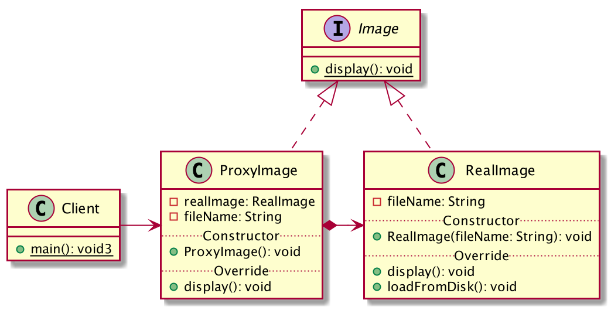

### 13.4 实现

1）创建一个接口。

**Image.java**

```java
public interface Image {
    void display();
}
```

2）创建实现接口的实体类。

**RealImage.java**

```java
public class RealImage implements Image {

    private String fileName;

    public RealImage(String fileName) {
        this.fileName = fileName;
        loadFromDisk();
    }

    @Override
    public void display() {
        System.out.println("显示图片：" + fileName);
    }

    public void loadFromDisk() {
        System.out.println("图片加载完成...");
    }
}
```

**ProxyImage.java**

```java
public class ProxyImage implements Image {

    private RealImage realImage;
    private String fileName;

    public ProxyImage(String fileName) {
        this.fileName = fileName;
    }

    @Override
    public void display() {
        if (realImage == null) {
            realImage = new RealImage(fileName);
        }

        realImage.display();
    }
}
```

3）当被请求时，使用 *ProxyImage* 来获取 *RealImage* 类的对象。

**Client.java**

```java
public class Client {
    public static void main(String[] args) {
        ProxyImage proxyImage = new ProxyImage("1.png");
        proxyImage.display();
        proxyImage.display();
    }
}
```

4）结果

``` shell
图片加载完成...
显示图片：1.png
显示图片：1.png
```

## 第 14 章 责任链模式

### 14.1 责任链模式

责任链模式（Chain of Responsibility Pattern）为请求创建了一个接收者对象的链。这种模式给予请求的类型，对请求的发送者和接收者进行解耦。

在这种模式中，通常每个接收者都包含对另一个接收者的引用。如果一个对象不能处理该请求，那么它会把相同的请求传给下一个接收者，依此类推。

### 14.2 介绍

| 重点     | 说明                                                         |
| -------- | ------------------------------------------------------------ |
| 意图     | 避免请求发送者与接收者耦合在一起，让多个对象都有可能接收请求，将这些对象连接成一条链，并且沿着这条链传递请求，直到有对象处理它为止。 |
| 主要解决 | 职责链上的处理者负责处理请求，客户只需要将请求发送到职责链上即可，无须关心请求的处理细节和请求的传递，所以职责链将请求的发送者和请求的处理者解耦了。 |
| 何时使用 | 在处理消息的时候以过滤很多道。                               |
| 如何解决 | 拦截的类都实现统一接口。                                     |
| 关键代码 | Handler 里面聚合它自己，在 HandlerRequest 里判断是否合适，如果没达到条件则向下传递，向谁传递之前 set 进去。 |
| 应用实例 | 1、红楼梦中的"击鼓传花"。 <br />2、JS 中的事件冒泡。 <br />3、JAVA WEB 中 Apache Tomcat 对 Encoding 的处理，Struts2 的拦截器，jsp servlet 的 Filter。 |
| 优点     | 1、降低耦合度。它将请求的发送者和接收者解耦。 <br />2、简化了对象。使得对象不需要知道链的结构。 <br />3、增强给对象指派职责的灵活性。通过改变链内的成员或者调动它们的次序，允许动态地新增或者删除责任。<br />4、增加新的请求处理类很方便。 |
| 缺点     | 1、不能保证请求一定被接收。 <br />2、系统性能将受到一定影响，而且在进行代码调试时不太方便，可能会造成循环调用。 <br />3、可能不容易观察运行时的特征，有碍于除错。 |
| 使用场景 | 1、有多个对象可以处理同一个请求，具体哪个对象处理该请求由运行时刻自动确定。 <br />2、在不明确指定接收者的情况下，向多个对象中的一个提交一个请求。 <br />3、可动态指定一组对象处理请求。 |
| 注意事项 | 在 JAVA WEB 中遇到很多应用。                                 |

### 14.3 思路

我们创建抽象类 *AbstractLogger*，带有详细的日志记录级别。然后我们创建三种类型的记录器，都扩展了 *AbstractLogger*。

每个记录器消息的级别是否属于自己的级别，如果是则相应地打印出来，否则将不打印并把消息传给下一个记录器。

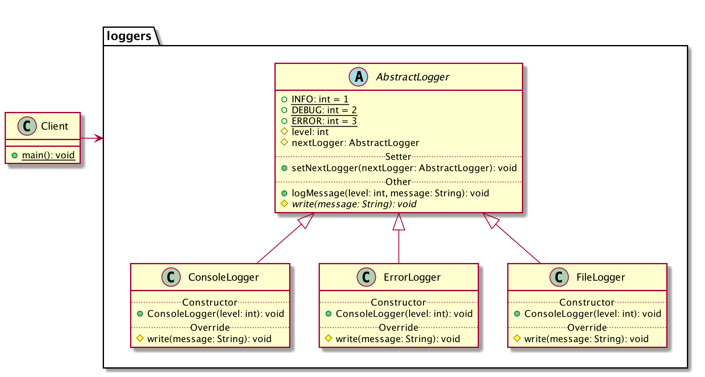

### 14.4 实现

1）创建抽象的记录器类。

**loggers/AbstractLogger.java**

```java
public abstract class AbstractLogger {
    public static final int INFO = 1;
    public static final int DEBUG = 2;
    public static final int ERROR = 3;

    protected int level;
    protected AbstractLogger nextLogger;

    public void setNextLogger(AbstractLogger nextLogger) {
        this.nextLogger = nextLogger;
    }

    public void logMessage(int level, String message) {
        if (this.level <= level) {
            write(message);
        }

        if (nextLogger != null) {
            nextLogger.logMessage(level, message);
        }
    }

    public abstract void write(String message);
}
```

2）创建扩展了该记录器类的实体类。

**loggers/ConsoleLogger.java**

```java
public class ConsoleLogger extends AbstractLogger {

    public ConsoleLogger(int level) {
        this.level = level;
    }

    @Override
    public void write(String message) {
        System.out.println("ConsoleLogger: " + message);
    }
}
```

**loggers/ErrorLogger.java**

```java
public class ErrorLogger extends AbstractLogger {

    public ErrorLogger(int level) {
        this.level = level;
    }

    @Override
    public void write(String message) {
        System.out.println("ErrorLogger: " + message);
    }
}
```

**loggers/FileLogger.java**

```java
public class FileLogger extends AbstractLogger {

    public FileLogger(int level) {
        this.level = level;
    }

    @Override
    public void write(String message) {
        System.out.println("FileLogger: " + message);
    }
}
```

3）创建不同类型的记录器。赋予它们不同的错误级别，并在每个记录器中设置下一个记录器。每个记录器中的下一个记录器代表的是链的一部分。

**Client.java**

```java
public class Client {
    public static void main(String[] args) {
        ErrorLogger logger = new ErrorLogger(AbstractLogger.ERROR);
        FileLogger fileLogger = new FileLogger(AbstractLogger.DEBUG);
        ConsoleLogger consoleLogger = new ConsoleLogger(AbstractLogger.INFO);

        logger.setNextLogger(fileLogger);
        fileLogger.setNextLogger(consoleLogger);

        logger.logMessage(AbstractLogger.INFO, "系统启动...");
        System.out.println();
        logger.logMessage(AbstractLogger.ERROR, "系统出错...");
        System.out.println();
        logger.logMessage(AbstractLogger.DEBUG, "系统bug...");
    }
}
```

4）结果

``` shell
ConsoleLogger: 系统启动...

ErrorLogger: 系统出错...
FileLogger: 系统出错...
ConsoleLogger: 系统出错...

FileLogger: 系统bug...
ConsoleLogger: 系统bug...
```

## 第 15 章 命令模式

### 15.1 命令模式

命令模式（Command Pattern）是一种数据驱动的设计模式，请求以命令的形式包裹在对象中，并传给调用对象。调用对象寻找可以处理该命令的合适的对象，并把该命令传给相应的对象，该对象执行命令。

### 15.2 介绍

| 重点     | 说明                                                         |
| -------- | ------------------------------------------------------------ |
| 意图     | 将一个请求封装成一个对象，从而使您可以用不同的请求对客户进行参数化。 |
| 主要解决 | 在软件系统中，行为请求者与行为实现者通常是一种紧耦合的关系，但某些场合，比如需要对行为进行记录、撤销或重做、事务等处理时，这种无法抵御变化的紧耦合的设计就不太合适。 |
| 何时使用 | 在某些场合，比如要对行为进行"记录、撤销/重做、事务"等处理，这种无法抵御变化的紧耦合是不合适的。在这种情况下，如何将"行为请求者"与"行为实现者"解耦？将一组行为抽象为对象，可以实现二者之间的松耦合。 |
| 如何解决 | 通过调用者调用接受者执行命令，顺序：调用者→命令→接受者。     |
| 关键代码 | 定义三个角色：<br />1、received 真正的命令执行对象 <br />2、Command <br />3、invoker 使用命令对象的入口 |
| 应用实例 | struts 1 中的 action 核心控制器 ActionServlet 只有一个，相当于 Invoker，而模型层的类会随着不同的应用有不同的模型类，相当于具体的 Command。 |
| 优点     | 1、降低了系统耦合度。 <br />2、新的命令可以很容易添加到系统中去。 |
| 缺点     | 使用命令模式可能会导致某些系统有过多的具体命令类。           |
| 使用场景 | 认为是命令的地方都可以使用命令模式，比如： <br />1、GUI 中每一个按钮都是一条命令。 <br />2、模拟 CMD。 |
| 注意事项 | 系统需要支持命令的撤销(Undo)操作和恢复(Redo)操作，也可以考虑使用命令模式，见命令模式的扩展。 |

### 15.3 思路

我们首先创建作为命令的接口 *Command*，然后创建作为请求的 *Stock* 类。实体命令类 *BuyStock* 和 *SellStock*，实现了 *Order* 接口，将执行实际的命令处理。创建作为调用对象的类 *Broker*，它接受订单并能下订单。

*Broker* 对象使用命令模式，基于命令的类型确定哪个对象执行哪个命令。*Client* 类使用 *Broker* 类来演示命令模式。

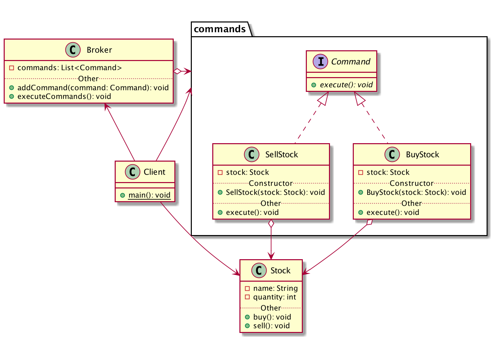

### 15.4 实现

1）创建一个命令接口。

**commands/Command.java**

```java
public interface Command {
    void execute();
}
```

2）创建一个请求类。

**Stock.java**

```java
public class Stock {
    private String name;
    private int quantity;

    public void buy() {
        System.out.println("buy");
    }

    public void sell() {
        System.out.println("sell");
    }
}
```

3）创建实现了 *Command* 接口的实体类。

**commands/BuyStock.java**

```java
public class BuyStock implements Command {

    private Stock stock;

    public BuyStock(Stock stock) {
        this.stock = stock;
    }

    @Override
    public void execute() {
        stock.buy();
    }
}
```

**commands/SellStock.java**

```java
public class SellStock implements Command {
    private Stock stock;

    public SellStock(Stock stock) {
        this.stock = stock;
    }

    @Override
    public void execute() {
        stock.sell();
    }
}
```

4）创建命令调用类。

**Broker.java**

```java
public class Broker {

    private List<Command> commands;

    public Broker() {
        commands = new ArrayList<>();
    }

    public void addCommand(Command command) {
        commands.add(command);
    }

    public void executeCommands() {
        commands.forEach(Command::execute);
    }
}
```

5）使用 Broker 类来接受并执行命令。

**Client.java**

```java
public class Client {
    public static void main(String[] args) {
        Broker broker = new Broker();
        broker.addCommand(new SellStock(new Stock()));
        broker.addCommand(new BuyStock(new Stock()));
        broker.executeCommands();
    }
}
```

6）结果

``` shell
sell
buy
```

## 第 16 章 解释器模式

### 16.1 解释器模式

解释器模式（Interpreter Pattern）提供了评估语言的语法或表达式的方式，该模式实现了一个表达式接口，该接口解释一个特定的上下文，被用在 SQL 解析、符号处理引擎等。

### 16.2 介绍

| 重点     | 说明                                                         |
| -------- | ------------------------------------------------------------ |
| 意图     | 给定一个语言，定义它的文法表示，并定义一个解释器，这个解释器使用该标识来解释语言中的句子。 |
| 主要解决 | 对于一些固定文法构建一个解释句子的解释器。                   |
| 何时使用 | 如果一种特定类型的问题发生的频率足够高，那么可能就值得将该问题的各个实例表述为一个简单语言中的句子。这样就可以构建一个解释器，该解释器通过解释这些句子来解决该问题。 |
| 如何解决 | 构建语法树，定义终结符与非终结符。                           |
| 关键代码 | 构建环境类，包含解释器之外的一些全局信息，一般是 HashMap。   |
| 应用实例 | 编译器、运算表达式计算。                                     |
| 优点     | 1、可扩展性比较好，灵活。 <br />2、增加了新的解释表达式的方式。 <br />3、易于实现简单文法。 |
| 缺点     | 1、可利用场景比较少。 <br />2、对于复杂的文法比较难维护。 <br />3、解释器模式会引起类膨胀。 <br />4、解释器模式采用递归调用方法。 |
| 使用场景 | 1、可以将一个需要解释执行的语言中的句子表示为一个抽象语法树。 <br />2、一些重复出现的问题可以用一种简单的语言来进行表达。 <br />3、一个简单语法需要解释的场景。 |
| 注意事项 | 可利用场景比较少，JAVA 中如果碰到可以用 expression4J 代替。  |

### 16.3 思路

我们将创建一个接口 *Expression* 和实现了 *Expression* 接口的实体类。定义作为上下文中主要解释器的 *TerminalExpression* 类。其他的类 *OrExpression*、*AndExpression* 用于创建组合式表达式。

*Client*，我们的演示类使用 *Expression* 类创建规则和演示表达式的解析。

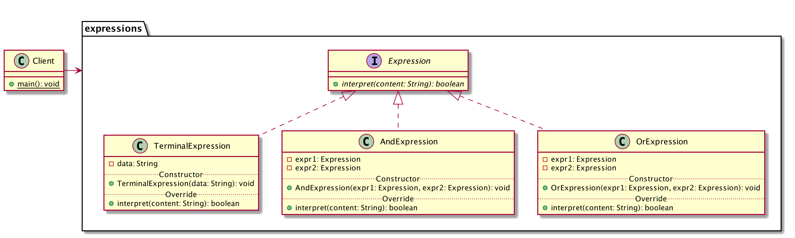

### 16.4 实现

1）创建一个表达式接口。

**expressions/Expression.java**

```java
public interface Expression {
    boolean interpret(String content);
}
```

2）创建实现了上述接口的实体类。

**expressions/AndExpression.java**

```java
public class AndExpression implements Expression {

    private Expression expr1;
    private Expression expr2;

    public AndExpression(Expression expr1, Expression expr2) {
        this.expr1 = expr1;
        this.expr2 = expr2;
    }

    @Override
    public boolean interpret(String content) {
        return expr1.interpret(content) && expr2.interpret(content);
    }
}
```

**expressions/OrExpression.java**

```java
public class OrExpression implements Expression {
    private Expression expr1;
    private Expression expr2;

    public OrExpression(Expression expr1, Expression expr2) {
        this.expr1 = expr1;
        this.expr2 = expr2;
    }

    @Override
    public boolean interpret(String content) {
        return expr1.interpret(content) || expr2.interpret(content);
    }
}
```

**expressions/TerminalExpression.java**

```java
public class TerminalExpression implements Expression {
    private String data;

    public TerminalExpression(String data) {
        this.data = data;
    }

    @Override
    public boolean interpret(String content) {
        return data.contains(content);
    }

}
```

3）*Client* 使用 *Expression* 类来创建规则，并解析它们。

**Client.java**

```java
public class Client {
    public static void main(String[] args) {
        Expression a = new TerminalExpression("a");
        Expression b = new TerminalExpression("b");

        Expression andExpression = new AndExpression(a, b);
        Expression orExpression = new OrExpression(a, b);

        System.out.println(andExpression.interpret("a"));
        System.out.println(orExpression.interpret("b"));

    }
}
```

4）结果

``` shell
false
true
```

## 第 17 章 迭代器模式

### 17.1 迭代器模式

迭代器模式（Iterator Pattern）是 Java 和 .Net 编程环境中非常常用的设计模式，用于顺序访问集合对象的元素，不需要知道集合对象的底层表示。

### 17.2 介绍

| 重点     | 说明                                                         |
| -------- | ------------------------------------------------------------ |
| 意图     | 提供一种方法顺序访问一个聚合对象中各个元素, 而又无须暴露该对象的内部表示。 |
| 主要解决 | 不同的方式来遍历整个整合对象。                               |
| 何时使用 | 遍历一个聚合对象。                                           |
| 如何解决 | 把在元素之间游走的责任交给迭代器，而不是聚合对象。           |
| 关键代码 | 定义接口方法：hasNext（判断是否存在下个元素），next（获取下个元素）。 |
| 应用实例 | JAVA 中的 iterator。                                         |
| 优点     | 1、它支持以不同的方式遍历一个聚合对象。 <br />2、迭代器简化了聚合类。 <br />3、在同一个聚合上可以有多个遍历。 <br />4、在迭代器模式中，增加新的聚合类和迭代器类都很方便，无须修改原有代码。 |
| 缺点     | 由于迭代器模式将存储数据和遍历数据的职责分离，增加新的聚合类需要对应增加新的迭代器类，类的个数成对增加，这在一定程度上增加了系统的复杂性。 |
| 使用场景 | 1、访问一个聚合对象的内容而无须暴露它的内部表示。 <br />2、需要为聚合对象提供多种遍历方式。 <br />3、为遍历不同的聚合结构提供一个统一的接口。 |
| 注意事项 | 迭代器模式就是分离了集合对象的遍历行为，抽象出一个迭代器类来负责，这样既可以做到不暴露集合的内部结构，又可让外部代码透明地访问集合内部的数据。 |

### 17.3 思路

我们将创建一个叙述导航方法的 *Iterator* 接口和一个返回迭代器的 *Container* 接口。实现了 *Container* 接口的实体类将负责实现 *Iterator* 接口。

*Client*，我们的演示类使用实体类 *NamesRepository* 来打印 *NamesRepository* 中存储为集合的 *Names*。

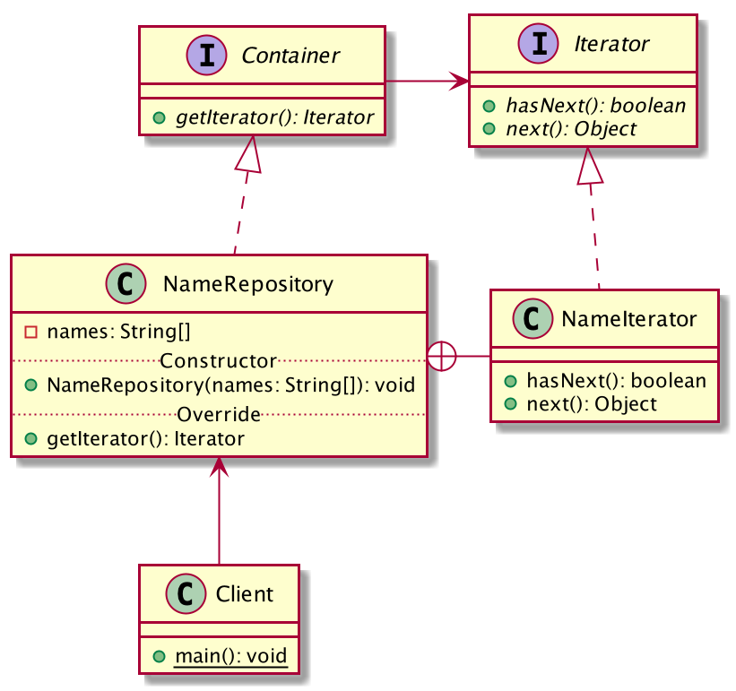

### 17.4 实现

1）创建接口。

**Container.java**

```java
public interface Container {
    Iterator getIterator();
}
```

**Iterator.java**

```java
public interface Iterator {
    boolean hasNext();

    Object next();
}
```

2）创建实现了 *Container* 接口的实体类，该类实现了 *Iterator* 接口的内部类 *NameIterator*。

**NameRepository.java**

```java
public class NameRepository implements Container {
    private String[] names;

    public NameRepository(String[] names) {
        this.names = names;
    }

    @Override
    public Iterator getIterator() {
        return new NameIterator();
    }

    private class NameIterator implements Iterator {
        private int index;

        @Override
        public boolean hasNext() {
            return index < names.length;
        }

        @Override
        public Object next() {
            return names[index++];
        }
    }

}
```

3）使用 *NameRepository* 来获取迭代器，并打印名字。

**Client.java**

```java
public class Client {
    public static void main(String[] args) {
        NameRepository nameRepository = new NameRepository(new String[]{"张三", "李四", "王五"});

        Iterator iterator = nameRepository.getIterator();
        while (iterator.hasNext()) {
            System.out.println(iterator.next());
        }
    }
}
```

4）结果

``` shell
张三
李四
王五
```

## 第 18 章 中介者模式

### 18.1 中介者模式

中介者模式（Mediator Pattern）是用来降低多个对象和类之间的通信复杂性。

这种模式提供了一个中介类，该类通常处理不同类之间的通信，并支持松耦合，使代码易于维护。

### 18.2 介绍

| 重点     | 说明                                                         |
| -------- | ------------------------------------------------------------ |
| 意图     | 用一个中介对象来封装一系列的对象交互，中介者使各对象不需要显式地相互引用，从而使其耦合松散，而且可以独立地改变它们之间的交互。 |
| 主要解决 | 对象与对象之间存在大量的关联关系，这样势必会导致系统的结构变得很复杂，同时若一个对象发生改变，我们也需要跟踪与之相关联的对象，同时做出相应的处理。 |
| 何时使用 | 多个类相互耦合，形成了网状结构。                             |
| 如何解决 | 将上述网状结构分离为星型结构。                               |
| 关键代码 | 对象 Colleague 之间的通信封装到一个类中单独处理。            |
| 应用实例 | 1、中国加入 WTO 之前是各个国家相互贸易，结构复杂，现在是各个国家通过 WTO 来互相贸易。 <br />2、机场调度系统。 <br />3、MVC 框架，其中C（控制器）就是 M（模型）和 V（视图）的中介者。 |
| 优点     | 1、降低了类的复杂度，将一对多转化成了一对一。 <br />2、各个类之间的解耦。 <br />3、符合迪米特原则。 |
| 缺点     | 中介者会庞大，变得复杂难以维护。                             |
| 使用场景 | 1、系统中对象之间存在比较复杂的引用关系，导致它们之间的依赖关系结构混乱而且难以复用该对象。 <br />2、想通过一个中间类来封装多个类中的行为，而又不想生成太多的子类。 |
| 注意事项 | 不应当在职责混乱的时候使用。                                 |

### 18.3 思路

我们通过聊天室实例来演示中介者模式。实例中，多个用户可以向聊天室发送消息，聊天室向所有的用户显示消息。我们将创建两个类 *ChatRoom*和 *User*。*User* 对象使用 *ChatRoom* 方法来分享他们的消息。

*Client*，我们的演示类使用 *User* 对象来显示他们之间的通信。

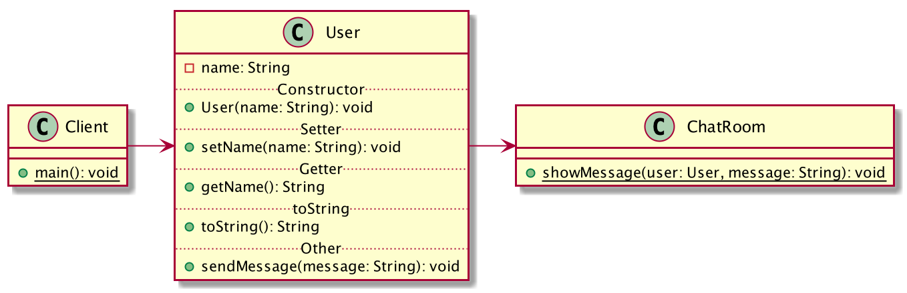

### 18.4 实现

1）创建中介类。

**ChatRoom.java**

```java
public class ChatRoom {
    public static void showMessage(User user, String message) {
        System.out.println(user + message);
    }
}
```

2）创建 user 类。

**User.java**

```java
public class User {
    private String name;

    public User(String name) {
        this.name = name;
    }

    public String getName() {
        return name;
    }

    public void setName(String name) {
        this.name = name;
    }

    @Override
    public String toString() {
        return "User{" +
                "name='" + name + '\'' +
                '}';
    }

    public void sendMessage(String message) {
        ChatRoom.showMessage(this, message);
    }
}
```

3）使用 *User* 对象来显示他们之间的通信。

**Client.java**

```java
public class Client {
    public static void main(String[] args) {
        User user1 = new User("张三");
        User user2 = new User("李四");

        user1.sendMessage("hello, 李四");
        user2.sendMessage("hello, 张三");
    }
}
```

4）结果

``` shell
User{name='张三'}hello, 李四
User{name='李四'}hello, 张三
```

## 第 19 章 备忘录模式

### 19.1 备忘录模式

备忘录模式（Memento Pattern）保存一个对象的某个状态，以便在适当的时候恢复对象。

### 19.2 介绍

| 重点     | 说明                                                         |
| -------- | ------------------------------------------------------------ |
| 意图     | 在不破坏封装性的前提下，捕获一个对象的内部状态，并在该对象之外保存这个状态。 |
| 主要解决 | 所谓备忘录模式就是在不破坏封装的前提下，捕获一个对象的内部状态，并在该对象之外保存这个状态，这样可以在以后将对象恢复到原先保存的状态。 |
| 何时使用 | 很多时候我们总是需要记录一个对象的内部状态，这样做的目的就是为了允许用户取消不确定或者错误的操作，能够恢复到他原先的状态，使得他有"后悔药"可吃。 |
| 如何解决 | 通过一个备忘录类专门存储对象状态。                           |
| 关键代码 | 客户不与备忘录类耦合，与备忘录管理类耦合。                   |
| 应用实例 | 1、后悔药。 <br />2、打游戏时的存档。 <br />3、Windows 里的 ctri + z。 <br />4、IE 中的后退。 <br />4、数据库的事务管理。 |
| 优点     | 1、给用户提供了一种可以恢复状态的机制，可以使用户能够比较方便地回到某个历史的状态。 <br />2、实现了信息的封装，使得用户不需要关心状态的保存细节。 |
| 缺点     | 消耗资源。如果类的成员变量过多，势必会占用比较大的资源，而且每一次保存都会消耗一定的内存。 |
| 使用场景 | 1、需要保存/恢复数据的相关状态场景。 <br />2、提供一个可回滚的操作。 |
| 注意事项 | 1、为了符合迪米特原则，还要增加一个管理备忘录的类。 <br />2、为了节约内存，可使用原型模式+备忘录模式。 |

### 19.3 思路

备忘录模式使用三个类 *Memento*、*Originator* 和 *CareTaker*。Memento 包含了要被恢复的对象的状态。Originator 创建并在 Memento 对象中存储状态。Caretaker 对象负责从 Memento 中恢复对象的状态。

*Client*，我们的演示类使用 *CareTaker* 和 *Originator* 对象来显示对象的状态恢复。

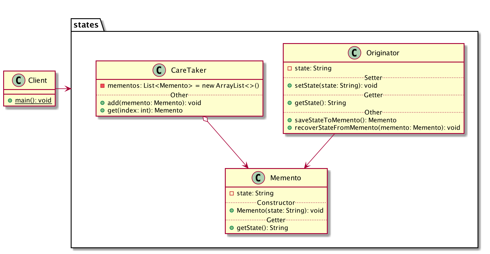

### 19.4 实现

1）创建 Memento 类。

**states/Memento.java**

```java
public class Memento {
    private String state;

    public Memento(String state) {
        this.state = state;
    }

    public String getState() {
        return state;
    }
}
```

2）创建 Originator 类。

**states/Originator.java**

```java
public class Originator {
    private String state;

    public void setState(String state) {
        this.state = state;
    }

    public String getState() {
        return state;
    }

    public Memento saveStateToMemento() {
        return new Memento(state);
    }

    public void recoverStateFromMemento(Memento memento) {
        state = memento.getState();
    }
}
```

3）创建 CareTaker 类。

**states/CareTaker.java**

```java
public class CareTaker {

    private List<Memento> mementos = new ArrayList<>();

    public void add(Memento memento) {
        mementos.add(memento);
    }

    public Memento get(int index) {
        return mementos.get(index);
    }
}
```

4）使用 *CareTaker* 和 *Originator* 对象。

**Client.java**

```java
public class Client {
    public static void main(String[] args) {
        Originator originator = new Originator();
        originator.setState("存档一");
        System.out.println(originator.getState());

        Memento memento = originator.saveStateToMemento();
        CareTaker careTaker = new CareTaker();
        careTaker.add(memento);
        originator.setState("存档二");
        System.out.println(originator.getState());

        originator.recoverStateFromMemento(careTaker.get(0));
        System.out.println(originator.getState());

    }
}
```

5）结果

``` shell
存档一
存档二
存档一
```

## 第 20 章 观察者模式

### 20.1 观察者模式

观察者模式（Observer Pattern）在对象间存在一对多关系时使用。

比如，当一个对象被修改时，则会自动通知依赖它的对象。观察者模式属于行为型模式。

### 20.2 介绍

| 重点     | 说明                                                         |
| -------- | ------------------------------------------------------------ |
| 意图     | 定义对象间的一种一对多的依赖关系，当一个对象的状态发生改变时，所有依赖于它的对象都得到通知并被自动更新。 |
| 主要解决 | 一个对象状态改变给其他对象通知的问题，而且要考虑到易用和低耦合，保证高度的协作。 |
| 何时使用 | 一个对象（目标对象）的状态发生改变，所有的依赖对象（观察者对象）都将得到通知，进行广播通知。 |
| 如何解决 | 使用面向对象技术，可以将这种依赖关系弱化。                   |
| 关键代码 | 在抽象类里有一个 ArrayList 存放观察者们。                    |
| 应用实例 | 1、拍卖的时候，拍卖师观察最高标价，然后通知给其他竞价者竞价。 <br />2、西游记里面悟空请求菩萨降服红孩儿，菩萨洒了一地水招来一个老乌龟，这个乌龟就是观察者，他观察菩萨洒水这个动作。 |
| 优点     | 1、观察者和被观察者是抽象耦合的。 2、建立一套触发机制。      |
| 缺点     | 1、如果一个被观察者对象有很多的直接和间接的观察者的话，将所有的观察者都通知到会花费很多时间。 2、如果在观察者和观察目标之间有循环依赖的话，观察目标会触发它们之间进行循环调用，可能导致系统崩溃。 3、观察者模式没有相应的机制让观察者知道所观察的目标对象是怎么发生变化的，而仅仅只是知道观察目标发生了变化。 |
| 使用场景 | 1、一个抽象模型有两个方面，其中一个方面依赖于另一个方面。将这些方面封装在独立的对象中使它们可以各自独立地改变和复用。 <br />2、一个对象的改变将导致其他一个或多个对象也发生改变，而不知道具体有多少对象将发生改变，可以降低对象之间的耦合度。 <br />3、一个对象必须通知其他对象，而并不知道这些对象是谁。 <br />4、需要在系统中创建一个触发链，A对象的行为将影响B对象，B对象的行为将影响C对象……，可以使用观察者模式创建一种链式触发机制。 |
| 注意事项 | 1、JAVA 中已经有了对观察者模式的支持类。 <br />2、避免循环引用。 <br />3、如果顺序执行，某一观察者错误会导致系统卡壳，一般采用异步方式。 |

### 20.3 思路

观察者模式使用三个类 Subject、Observer 和 Client。Subject 对象带有绑定观察者到 Client 对象和从 Client 对象解绑观察者的方法。我们创建 *Subject* 类、*Observer* 抽象类和扩展了抽象类 *Observer* 的实体类。

*Client*，我们的演示类使用 *Subject* 和实体类对象来演示观察者模式。

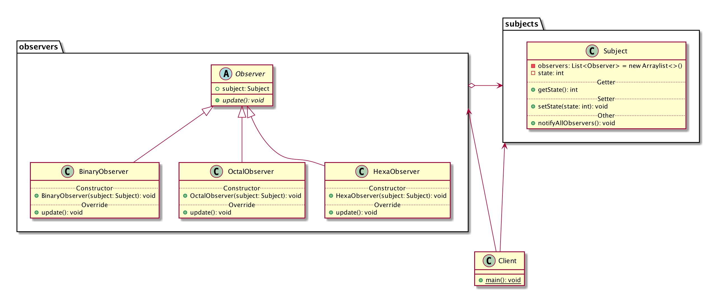

### 20.4 实现

1）创建 Subject 类。

**subjects/Subject.java**

```java
public class Subject {
    private List<Observer> observers = new ArrayList<>();
    private int state;

    public int getState() {
        return state;
    }

    public void setState(int state) {
        this.state = state;
        notifyAllObservers();
    }

    public void add(Observer observer) {
        observers.add(observer);
    }

    public void notifyAllObservers() {
        observers.parallelStream().forEach(Observer::update);
    }
}
```

2）创建 Observer 类。

**observers/Observer.java**

```java
public abstract class Observer {
    protected Subject subject;

    public abstract void update();
}
```

3）创建实体观察者类。

**observers/BinaryObserver.java**

```java
public class BinaryObserver extends Observer {

    public BinaryObserver(Subject subject) {
        subject.add(this);
    }

    @Override
    public void update() {
        System.out.println("BinaryObserver已更新");
    }
}
```

**observers/HexaObserver.java**

```java
public class HexaObserver extends Observer {

    public HexaObserver(Subject subject) {
        subject.add(this);
    }

    @Override
    public void update() {
        System.out.println("HexaObserver已更新");
    }
}
```

**observers/OctalObserver.java**

```java
public class OctalObserver extends Observer {

    public OctalObserver(Subject subject) {
        subject.add(this);
    }

    @Override
    public void update() {
        System.out.println("OctalObserver已更新");
    }
}
```

4）使用 *Subject* 和实体观察者对象。

**Client.java**

```java
public class Client {
    public static void main(String[] args) {
        Subject subject = new Subject();

        new BinaryObserver(subject);
        new HexaObserver(subject);
        new OctalObserver(subject);

        subject.setState(1);
    }
}
```

5）结果

``` shell
HexaObserver已更新
BinaryObserver已更新
OctalObserver已更新
```

## 第 21 章 状态模式

### 21.1 状态模式

状态模式（State Pattern）中类的行为是基于它的状态改变的，我们创建表示各种状态的对象和一个行为随着状态对象改变而改变的 context 对象。

### 21.2 介绍

| 重点     | 说明                                                         |
| -------- | ------------------------------------------------------------ |
| 意图     | 允许对象在内部状态发生改变时改变它的行为，对象看起来好像修改了它的类。 |
| 主要解决 | 对象的行为依赖于它的状态（属性），并且可以根据它的状态改变而改变它的相关行为。 |
| 何时使用 | 代码中包含大量与对象状态有关的条件语句。                     |
| 如何解决 | 将各种具体的状态类抽象出来。                                 |
| 关键代码 | 通常命令模式的接口中只有一个方法。而状态模式的接口中有一个或者多个方法。而且，状态模式的实现类的方法，一般返回值，或者是改变实例变量的值。也就是说，状态模式一般和对象的状态有关。实现类的方法有不同的功能，覆盖接口中的方法。状态模式和命令模式一样，也可以用于消除 if...else 等条件选择语句。 |
| 应用实例 | 1、打篮球的时候运动员可以有正常状态、不正常状态和超常状态。 <br />2、曾侯乙编钟中，'钟是抽象接口','钟A'等是具体状态，'曾侯乙编钟'是具体环境（Context）。 |
| 优点     | 1、封装了转换规则。 <br />2、枚举可能的状态，在枚举状态之前需要确定状态种类。 <br />3、将所有与某个状态有关的行为放到一个类中，并且可以方便地增加新的状态，只需要改变对象状态即可改变对象的行为。 <br />4、允许状态转换逻辑与状态对象合成一体，而不是某一个巨大的条件语句块。 <br />5、可以让多个环境对象共享一个状态对象，从而减少系统中对象的个数。 |
| 缺点     | 1、状态模式的使用必然会增加系统类和对象的个数。 <br />2、状态模式的结构与实现都较为复杂，如果使用不当将导致程序结构和代码的混乱。 <br />3、状态模式对"开闭原则"的支持并不太好，对于可以切换状态的状态模式，增加新的状态类需要修改那些负责状态转换的源代码，否则无法切换到新增状态，而且修改某个状态类的行为也需修改对应类的源代码。 |
| 使用场景 | 1、行为随状态改变而改变的场景。 <br />2、条件、分支语句的代替者。 |
| 注意事项 | 在行为受状态约束的时候使用状态模式，而且状态不超过 5 个。    |

### 21.3 思路

我们将创建一个 *State* 接口和实现了 *State* 接口的实体状态类。*Context* 是一个带有某个状态的类。

*Client*，我们的演示类使用 *Context* 和状态对象来演示 Context 在状态改变时的行为变化。

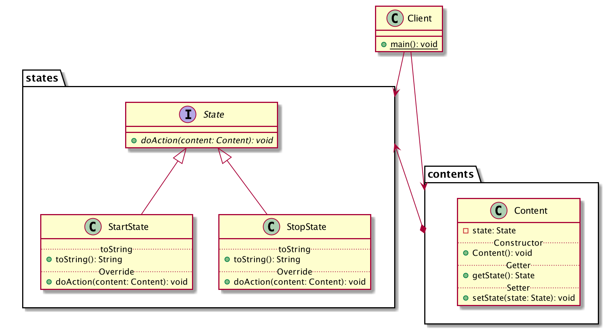

### 21.4 实现

1）创建一个接口。

**sates/State.java**

```java
public interface State {
    void doAction(Content content);
}
```

2）创建实现接口的实体类。

**sates/StartState.java**

```java
public class StartState implements State {

    @Override
    public void doAction(Content content) {
        content.setState(this);
    }

    @Override
    public String toString() {
        return "StartState{}";
    }
}
```

**sates/StopState.java**

```java
public class StopState implements State {

    @Override
    public void doAction(Content content) {
        content.setState(this);
    }

    @Override
    public String toString() {
        return "StopState{}";
    }

}
```

3）创建 *Context* 类。

**contents/Content.java**

```java
public class Content {

    private State state;

    public Content() {
    }

    public State getState() {
        return state;
    }

    public void setState(State state) {
        this.state = state;
    }
}
```

4）使用 *Context* 来查看当状态 *State* 改变时的行为变化。

**Client.java**

```java
public class Client {
    public static void main(String[] args) {
        Content content = new Content();

        new StartState().doAction(content);
        System.out.println(content.getState());

        new StopState().doAction(content);
        System.out.println(content.getState());
    }
}
```

5）结果

``` shell
StartState{}
StopState{}
```

## 第 22 章 策略模式

### 22.1 策略模式

策略模式（Strategy Pattern）中一个类的行为或其算法可以在运行时更改，我们创建表示各种策略的对象和一个行为随着策略对象改变而改变的 context 对象，策略对象改变 context 对象的执行算法。

### 22.2 介绍

| 重点     | 说明                                                         |
| -------- | ------------------------------------------------------------ |
| 意图     | 定义一系列的算法,把它们一个个封装起来, 并且使它们可相互替换。 |
| 主要解决 | 在有多种算法相似的情况下，使用 if...else 所带来的复杂和难以维护。 |
| 何时使用 | 一个系统有许多许多类，而区分它们的只是他们直接的行为。       |
| 如何解决 | 将这些算法封装成一个一个的类，任意地替换。                   |
| 关键代码 | 实现同一个接口。                                             |
| 应用实例 | 1、诸葛亮的锦囊妙计，每一个锦囊就是一个策略。 <br />2、旅行的出游方式，选择骑自行车、坐汽车，每一种旅行方式都是一个策略。 <br />3、JAVA AWT 中的 LayoutManager。 |
| 优点     | 1、算法可以自由切换。 <br />2、避免使用多重条件判断。 <br />3、扩展性良好。 |
| 缺点     | 1、策略类会增多。 <br />2、所有策略类都需要对外暴露。        |
| 使用场景 | 1、如果在一个系统里面有许多类，它们之间的区别仅在于它们的行为，那么使用策略模式可以动态地让一个对象在许多行为中选择一种行为。 <br />2、一个系统需要动态地在几种算法中选择一种。 <br />3、如果一个对象有很多的行为，如果不用恰当的模式，这些行为就只好使用多重的条件选择语句来实现。 |
| 注意事项 | 如果一个系统的策略多于四个，就需要考虑使用混合模式，解决策略类膨胀的问题。 |

### 22.3 思路

我们将创建一个定义活动的 *Strategy* 接口和实现了 *Strategy* 接口的实体策略类。*Context* 是一个使用了某种策略的类。

*Client*，我们的演示类使用 *Context* 和策略对象来演示 Context 在它所配置或使用的策略改变时的行为变化。

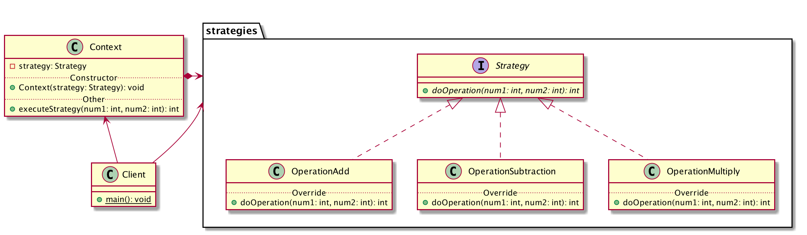

### 22.4 实现

1）创建一个接口。

**strategies/Strategy.java**

```java
public interface Strategy {
    int doOperation(int num1, int num2);
}
```

2）创建实现接口的实体类。

**strategies/OperationAdd.java**

```java
public class OperationAdd implements Strategy {
    @Override
    public int doOperation(int num1, int num2) {
        return num1 + num2;
    }
}
```

**strategies/OperationMultiply.java**

```java
public class OperationMultiply implements Strategy {
    @Override
    public int doOperation(int num1, int num2) {
        return num1 * num2;
    }
}
```

**strategies/OperationSubtraction.java**

```java
public class OperationSubtraction implements Strategy {
    @Override
    public int doOperation(int num1, int num2) {
        return num1 - num2;
    }
}
```

3）创建 *Context* 类。

**Context.java**

```java
public class Context {
    private Strategy strategy;

    public Context(Strategy strategy) {
        this.strategy = strategy;
    }

    public int executeStrategy(int num1, int num2) {
        return strategy.doOperation(num1, num2);
    }
}
```

4）使用 *Context* 来查看当它改变策略 *Strategy* 时的行为变化。

**Client.java**

```java
public class Client {
    public static void main(String[] args) {
        int a = new Context(new OperationAdd()).executeStrategy(1, 2);
        System.out.println(a);

        int b = new Context(new OperationSubtraction()).executeStrategy(1, 2);
        System.out.println(b);

        int c = new Context(new OperationMultiply()).executeStrategy(1, 2);
        System.out.println(c);

    }
}
```

5）结果

``` shell
3
-1
2
```

## 第 23 章 模板模式

### 23.1 模板模式

模板模式（Template Pattern）中一个抽象类公开定义了执行它的方法的方式/模板。它的子类可以按需要重写方法实现，但调用将以抽象类中定义的方式进行。

### 23.2 介绍

| 重点     | 说明                                                         |
| -------- | ------------------------------------------------------------ |
| 意图     | 定义一个操作中的算法的骨架，而将一些步骤延迟到子类中。模板方法使得子类可以不改变一个算法的结构即可重定义该算法的某些特定步骤。 |
| 主要解决 | 一些方法通用，却在每一个子类都重新写了这一方法。             |
| 何时使用 | 有一些通用的方法。                                           |
| 如何解决 | 将这些通用算法抽象出来。                                     |
| 关键代码 | 在抽象类实现，其他步骤在子类实现。                           |
| 应用实例 | 1、在造房子的时候，地基、走线、水管都一样，只有在建筑的后期才有加壁橱加栅栏等差异。 <br />2、西游记里面菩萨定好的 81 难，这就是一个顶层的逻辑骨架。 <br />3、spring 中对 Hibernate 的支持，将一些已经定好的方法封装起来，比如开启事务、获取 Session、关闭 Session 等，程序员不重复写那些已经规范好的代码，直接丢一个实体就可以保存。 |
| 优点     | 1、封装不变部分，扩展可变部分。 <br />2、提取公共代码，便于维护。 <br />3、行为由父类控制，子类实现。 |
| 缺点     | 每一个不同的实现都需要一个子类来实现，导致类的个数增加，使得系统更加庞大。 |
| 使用场景 | 1、有多个子类共有的方法，且逻辑相同。 <br />2、重要的、复杂的方法，可以考虑作为模板方法。 |
| 注意事项 | 为防止恶意操作，一般模板方法都加上 final 关键词。            |

### 23.3 思路

我们将创建一个定义操作的 *Game* 抽象类，其中，模板方法设置为 final，这样它就不会被重写。*Cricket* 和 *Football* 是扩展了 *Game* 的实体类，它们重写了抽象类的方法。

*Client*，我们的演示类使用 *Game* 来演示模板模式的用法。

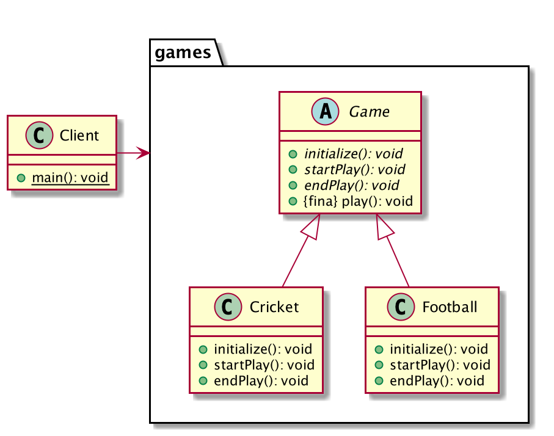

### 23.4 实现

1）创建一个抽象类，它的模板方法被设置为 final。

**games/Game.java**

```java
public abstract class Game {
    public abstract void initialize();

    public abstract void startPlay();

    public abstract void endPlay();

    public final void play() {
        initialize();
        startPlay();
        endPlay();
    }
}
```

2）创建扩展了上述类的实体类。

**games/Cricket.java**

```java
public class Cricket extends Game {
    @Override
    public void initialize() {
        System.out.println("Cricket-initialize");
    }

    @Override
    public void startPlay() {
        System.out.println("Cricket-startPlay");
    }

    @Override
    public void endPlay() {
        System.out.println("Cricket-endPlay");
    }
}
```

**games/Football.java**

```java
public class Football extends Game {
    @Override
    public void initialize() {
        System.out.println("Football-initialize");
    }

    @Override
    public void startPlay() {
        System.out.println("Football-startPlay");
    }

    @Override
    public void endPlay() {
        System.out.println("Football-endPlay");
    }
}
```

3）使用 *Game* 的模板方法 play() 来演示游戏的定义方式。

**Client.java**

```java
public class Client {
    public static void main(String[] args) {
        Game cricket = new Cricket();
        cricket.play();

        Game football = new Football();
        football.play();
    }
}
```

4）结果

``` shell
Cricket-initialize
Cricket-startPlay
Cricket-endPlay
Football-initialize
Football-startPlay
Football-endPlay
```

## 第 24 章 访问者模式

### 24.1 访问者模式

访问者模式（Visitor Pattern）中，我们使用了一个访问者类，它改变了元素类的执行算法。通过这种方式，元素的执行算法可以随着访问者改变而改变。

根据模式，元素对象已接受访问者对象，这样访问者对象就可以处理元素对象上的操作。

### 24.2 介绍

| 重点     | 说明                                                         |
| -------- | ------------------------------------------------------------ |
| 意图     | 主要将数据结构与数据操作分离。                               |
| 主要解决 | 稳定的数据结构和易变的操作耦合问题。                         |
| 何时使用 | 需要对一个对象结构中的对象进行很多不同的并且不相关的操作，而需要避免让这些操作"污染"这些对象的类，使用访问者模式将这些封装到类中。 |
| 如何解决 | 在被访问的类里面加一个对外提供接待访问者的接口。             |
| 关键代码 | 在数据基础类里面有一个方法接受访问者，将自身引用传入访问者。 |
| 应用实例 | 您在朋友家做客，您是访问者，朋友接受您的访问，您通过朋友的描述，然后对朋友的描述做出一个判断，这就是访问者模式。 |
| 优点     | 1、符合单一职责原则。 2、优秀的扩展性。 3、灵活性。          |
| 缺点     | 1、具体元素对访问者公布细节，违反了迪米特原则。 2、具体元素变更比较困难。 3、违反了依赖倒置原则，依赖了具体类，没有依赖抽象。 |
| 使用场景 | 1、对象结构中对象对应的类很少改变，但经常需要在此对象结构上定义新的操作。 2、需要对一个对象结构中的对象进行很多不同的并且不相关的操作，而需要避免让这些操作"污染"这些对象的类，也不希望在增加新操作时修改这些类。 |
| 注意事项 | 访问者可以对功能进行统一，可以做报表、UI、拦截器与过滤器。   |

### 24.3 思路

我们将创建一个定义接受操作的 *ComputerPart* 接口。*Keyboard*、*Mouse*、*Monitor* 和 *Computer* 是实现了 *ComputerPart* 接口的实体类。我们将定义另一个接口 *ComputerPartVisitor*，它定义了访问者类的操作。*Computer* 使用实体访问者来执行相应的动作。

*Client*，我们的演示类使用 *Computer*、*ComputerPartVisitor* 类来演示访问者模式的用法。

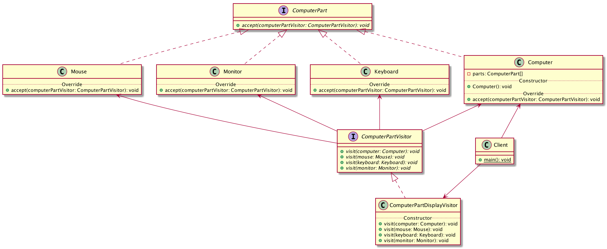

### 24.4 实现

1）定义一个表示元素的接口。

**ComputerPart.java**

```java
public interface ComputerPart {
    void accept(ComputerPartVisitor computerPartVisitor);
}
```

2）创建扩展了上述类的实体类。

**Keyboard.java**

```java
public class Keyboard implements ComputerPart {
    @Override
    public void accept(ComputerPartVisitor computerPartVisitor) {
        computerPartVisitor.visit(this);
    }
}
```

**Monitor.java**

```java
public class Monitor implements ComputerPart {
    @Override
    public void accept(ComputerPartVisitor computerPartVisitor) {
        computerPartVisitor.visit(this);
    }
}
```

**Mouse.java**

```java
public class Mouse implements ComputerPart {
    @Override
    public void accept(ComputerPartVisitor computerPartVisitor) {
        computerPartVisitor.visit(this);
    }
}
```

**Computer.java**

```java
public class Computer implements ComputerPart {
    private ComputerPart[] parts;

    public Computer() {
        parts = new ComputerPart[]{new Mouse(), new Monitor(), new Keyboard()};
    }

    @Override
    public void accept(ComputerPartVisitor computerPartVisitor) {
        for (ComputerPart part : parts) {
            part.accept(computerPartVisitor);
        }

        computerPartVisitor.visit(this);
    }
}
```

3）定义一个表示访问者的接口。

**ComputerPartVisitor.java**

```java
public interface ComputerPartVisitor {
    void visit(Computer computer);

    void visit(Mouse mouse);

    void visit(Keyboard keyboard);

    void visit(Monitor monitor);
}
```

4）创建实现了上述类的实体访问者。

**ComputerPartDisplayVisitor.java**

```java
public class ComputerPartDisplayVisitor implements ComputerPartVisitor {
    @Override
    public void visit(Computer computer) {
        System.out.println(computer);
    }

    @Override
    public void visit(Mouse mouse) {
        System.out.println(mouse);
    }

    @Override
    public void visit(Keyboard keyboard) {
        System.out.println(keyboard);
    }

    @Override
    public void visit(Monitor monitor) {
        System.out.println(monitor);
    }
}
```

5）使用 *ComputerPartDisplayVisitor* 来显示 *Computer* 的组成部分。

**Client.java**

```java
public class Client {
    public static void main(String[] args) {
        Computer computer = new Computer();
        computer.accept(new ComputerPartDisplayVisitor());
    }
}
```

6）结果

``` shell
com.designpattern.behavioral.visitor.Mouse@3764951d
com.designpattern.behavioral.visitor.Monitor@4b1210ee
com.designpattern.behavioral.visitor.Keyboard@4d7e1886
com.designpattern.behavioral.visitor.Computer@3cd1a2f1
```

